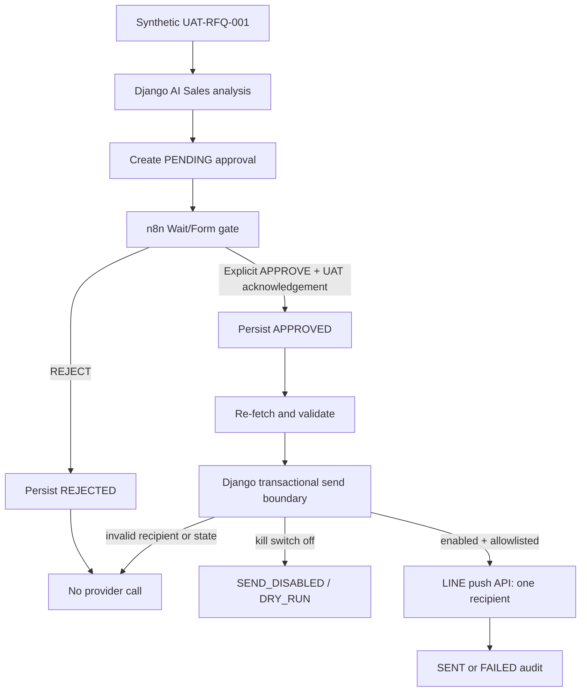

# n8n + LINE UAT Approval Demo

> **THIS WORKFLOW IS UAT ONLY. DO NOT CONNECT REAL CUSTOMER DATA. DO NOT ENABLE PRODUCTION SENDING.**

## Purpose

This demo turns the existing advisory AI Sales analysis into a proposed LINE message, stores it as `PENDING`, and requires a Manager/Admin to explicitly approve or reject the exact text. n8n orchestrates the flow. Django owns the safety boundary and is the only component allowed to call the LINE push API.

AI Sales remains advisory: every stored analysis has `human_approval_required=true` and `autonomous_action=false`.

## Architecture



The LINE token is deliberately absent from n8n. This prevents an edited workflow from bypassing Django's approval, allowlist, kill switch, and idempotency checks.

## Safety boundaries

- The bundled fixture is synthetic and fixed to `environment=uat`.
- Database constraints reject non-UAT, non-synthetic, or non-LINE approval records.
- New drafts always start `PENDING`.
- Only `PENDING` can transition to `APPROVED` or `REJECTED`.
- Only `APPROVED` can enter the send operation.
- `REJECTED`, `PENDING`, and `FAILED` never send.
- `SENT` is idempotent: a retry returns the existing result and does not call LINE again.
- The exact message and routing fields are hashed at approval; any later mutation fails closed.
- The send operation commits an at-most-once claim before calling LINE. Concurrent or automatic retries observe the claim and do not call the provider again.
- Every first provider request carries the approval UUID as `X-Line-Retry-Key`, following LINE's retry-key contract.
- The recipient must exactly match `LINE_UAT_RECIPIENT_USER_ID`.
- `LINE_SEND_ENABLED` defaults to `false`; disabled sends remain `APPROVED` and record `SEND_DISABLED` / `DRY_RUN` without a provider request.
- Only a single LINE push recipient is supported. Broadcast, multicast, and narrowcast are not implemented.
- Approval/rejection/send require an authenticated Manager or Admin. A Sales user may create and inspect a draft but cannot decide or send it.
- Provider errors store a bounded error code, never a bearer token or raw Authorization header.
- The n8n wait form has no automatic approval or timeout-to-send path.

This is at-most-once UAT delivery, not a claim of guaranteed delivery. A process crash after the claim is committed can leave the record at `APPROVED` with `line_result_status=SENDING`. That state requires human reconciliation and is never retried automatically. See [LINE's retry guidance](https://developers.line.biz/en/docs/messaging-api/retrying-api-request/).

## Synthetic fixture

The source-controlled fixture is `django_backend/apps/ai_agent/fixtures/line_uat_demo.json`:

- Customer: `UAT-CUST-001`, UAT Tanaka Manufacturing
- RFQ: `UAT-RFQ-001`
- Part: SUS304 Precision Bracket
- Quantity: 100
- Note: `UAT ONLY - DO NOT CONTACT REAL CUSTOMER`
- LINE user ID: environment placeholder only

Do not replace this fixture with customer data.

## Configuration

### Django

```dotenv
N8N_UAT_BASE_URL=http://localhost:5678
N8N_UAT_WEBHOOK_SECRET=
LINE_UAT_CHANNEL_ACCESS_TOKEN=
LINE_UAT_CHANNEL_SECRET=
LINE_UAT_RECIPIENT_USER_ID=
LINE_SEND_ENABLED=false
```

`LINE_UAT_CHANNEL_SECRET` is reserved for future signed LINE webhook verification and is not used by the outbound-only demo. `N8N_UAT_WEBHOOK_SECRET` is reserved for a future inbound trigger; this workflow uses Django bearer authentication and n8n's generated Wait/Form URL.

### n8n

Expose these variables to the n8n process:

```dotenv
DJANGO_UAT_BASE_URL=http://django:8000
DJANGO_UAT_BEARER_TOKEN=<short-lived Manager/Admin foundation token>
```

Do not put the LINE channel access token in n8n. Restrict access to workflow execution data because the Django bearer token is used in HTTP Request headers.

## Install and run Django

From the repository root:

```powershell
python -m pip install -r django_backend/requirements.txt
python django_backend/manage.py migrate
python django_backend/manage.py runserver 127.0.0.1:8000
```

Create or select a synthetic UAT Manager/Admin account using the existing foundation user tooling, sign in through `POST /api/v1/foundation/auth/login/`, and provide the returned token to n8n as `DJANGO_UAT_BEARER_TOKEN`.

## Import n8n workflow

1. Open n8n and choose **Import from File**.
2. Select `automation/n8n/line_uat_approval_demo.json`.
3. Confirm the workflow name is **UAT - AI Sales LINE Approval Demo**.
4. Keep the workflow inactive while validating environment variables.
5. Confirm the **Human Approval Gate** displays the RFQ, AI recommendation, exact LINE text, UAT recipient label, and warning.
6. Do not replace the Wait/Form node with an automatic decision.

If n8n is running in Docker, `DJANGO_UAT_BASE_URL` must be reachable from the n8n container (for example, the Compose service URL rather than `127.0.0.1`).

## Internal endpoints

All endpoints require a foundation Bearer token.

| Method | Endpoint | Role | Purpose |
|---|---|---|---|
| POST | `/api/v1/internal/line-uat/drafts/` | Sales, Manager, Admin | Analyze fixed synthetic RFQ and create `PENDING` |
| GET | `/api/v1/internal/line-uat/approvals/{uuid}/` | Sales, Manager, Admin | Read safe approval/audit payload |
| POST | `/api/v1/internal/line-uat/approvals/{uuid}/approve/` | Manager, Admin | Explicit human approval |
| POST | `/api/v1/internal/line-uat/approvals/{uuid}/reject/` | Manager, Admin | Explicit rejection; no send |
| POST | `/api/v1/internal/line-uat/approvals/{uuid}/send/` | Manager, Admin | Transactional kill-switch/allowlist/idempotency gate and LINE push |

Create a draft:

```powershell
$headers = @{ Authorization = "Bearer $env:DJANGO_UAT_BEARER_TOKEN" }
$draft = Invoke-RestMethod -Method Post `
  -Uri "http://127.0.0.1:8000/api/v1/internal/line-uat/drafts/" `
  -Headers $headers -ContentType "application/json" `
  -Body '{"rfq_id":"UAT-RFQ-001","synthetic":true,"environment":"uat"}'
$approvalId = $draft.data.approval_id
```

Reject:

```powershell
Invoke-RestMethod -Method Post `
  -Uri "http://127.0.0.1:8000/api/v1/internal/line-uat/approvals/$approvalId/reject/" `
  -Headers $headers -ContentType "application/json" `
  -Body '{"reason":"Rejected during UAT"}'
```

Approve and invoke the send gate:

```powershell
Invoke-RestMethod -Method Post `
  -Uri "http://127.0.0.1:8000/api/v1/internal/line-uat/approvals/$approvalId/approve/" `
  -Headers $headers -ContentType "application/json" -Body '{}'

Invoke-RestMethod -Method Post `
  -Uri "http://127.0.0.1:8000/api/v1/internal/line-uat/approvals/$approvalId/send/" `
  -Headers $headers -ContentType "application/json" -Body '{}'
```

## Reproducible demo

### Scenario A — Reject

1. Keep `LINE_SEND_ENABLED=false`.
2. Execute the n8n workflow manually.
3. Inspect the exact synthetic message in the approval form.
4. Select `REJECT`, enter an optional reason, and submit.
5. Fetch the approval and verify `status=REJECTED`, `line_result_status=REJECTED_NO_SEND`, and `send_attempted=false`.
6. Verify the send node was not reached and no LINE request exists.

### Scenario B — Approve with kill switch disabled

1. Set `LINE_SEND_ENABLED=false` and restart Django so settings reload.
2. Execute the workflow and explicitly choose `APPROVE` plus the UAT acknowledgement.
3. Verify the final record remains `status=APPROVED`, reports `line_result_status=SEND_DISABLED`, contains `provider_response.mode=DRY_RUN`, and has `send_attempted=false`.

### Scenario C — Send to the operator's UAT LINE account

Only the operator may perform this scenario.

1. Create a dedicated LINE Messaging API channel in the LINE Developers Console. Do not reuse a production channel.
2. Add the bot as a friend from the operator's own UAT LINE account.
3. Obtain that account's LINE user ID through the dedicated UAT channel's controlled setup process.
4. Set `LINE_UAT_CHANNEL_ACCESS_TOKEN` to the UAT channel token.
5. Set `LINE_UAT_RECIPIENT_USER_ID` to the operator's own UAT LINE user ID.
6. Set `LINE_SEND_ENABLED=true` and restart Django.
7. Execute the workflow, inspect the exact text, acknowledge UAT, and explicitly approve.
8. If LINE reports the request accepted, verify one message arrives and the audit is `SENT` with `send_attempted=true`.
9. Retry the send endpoint or workflow step with the same approval UUID.
10. Verify the existing `SENT` result is returned and no second LINE message arrives.

If an execution remains `SENDING`, do not reset or resend it. Compare the stored claim timestamp and provider evidence, then resolve it manually. LINE retains retry keys for 24 hours; this demo deliberately has no automated reconciliation path.

Immediately restore `LINE_SEND_ENABLED=false` after the demonstration.

## LINE Developers Console checklist

- Dedicated UAT provider/channel only
- Messaging API enabled
- Operator's own UAT account only
- Channel access token stored only in runtime secrets
- No token, channel secret, or user ID committed to Git
- No webhook is required for this outbound-only demo
- No production customer lists connected

## Audit record

Each `OutboundMessageApproval` stores the approval UUID, RFQ ID, synthetic/UAT markers, AI analysis, exact proposed/final text, approval content hash, status, approver/rejector and timestamp, provider claim/attempt flag, bounded provider result, delivery timestamp, and chronological audit events. Secrets are excluded.

## Tests and validation

```powershell
python -m pytest tests/test_line_uat_approval.py -q
python -m pytest tests/test_ai_sales_mvp.py tests/test_sales_crm_ai.py -q
python django_backend/manage.py makemigrations --check --dry-run
python django_backend/manage.py check
python -m json.tool automation/n8n/line_uat_approval_demo.json > $null
python -m ruff check django_backend/apps/ai_agent tests/test_line_uat_approval.py
```

All provider calls are mocked in automated tests. Tests must never be run with a real LINE call adapter substituted.

## Rollback and kill switch

Emergency stop:

1. Set `LINE_SEND_ENABLED=false`.
2. Restart Django workers.
3. Deactivate the n8n workflow.
4. Revoke the UAT LINE channel access token in the LINE Developers Console if compromise is suspected.

Application rollback may revert the feature commit and migrate `ai_agent` back to migration `0002` only after retaining any required UAT audit evidence. Database rollback deletes the UAT approval table and is destructive; take an approved backup first.

## Known limitations

- This is a single-recipient, text-only UAT demonstration.
- There is no production mode, bulk send, broadcast, multicast, or narrowcast.
- Draft content is deterministic around one bundled synthetic RFQ.
- Foundation bearer token rotation and n8n secret storage remain operator responsibilities.
- A provider `FAILED` record is terminal in this demo; create and approve a new draft for a controlled retry.
- A stuck `SENDING` claim requires manual reconciliation and cannot be retried automatically.
- LINE retry-key deduplication is provider-managed for 24 hours; do not reset a claim or reuse the approval after that window.
- The Wait/Form execution remains pending until a human responds or an operator cancels it; cancellation sends nothing.
