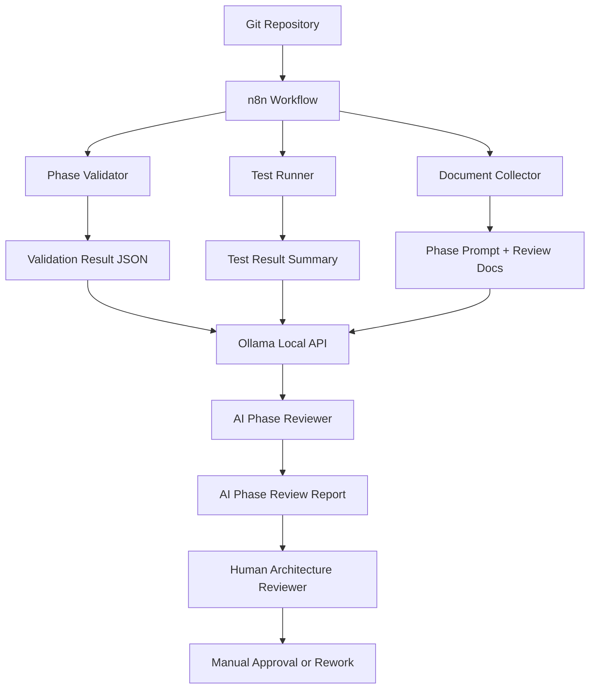

# AI DevOps Control Center Architecture

## Purpose

The AI DevOps Control Center helps operators validate migration phases faster.
It collects Git state, required documents, test status, validation output, and
risk signals, then prepares an AI-assisted review report.

It does not approve production, deploy code, change routes, or replace the
human architecture reviewer.

## Architecture Diagram

## Components

| Component | Responsibility |
| --- | --- |
| Git Repository | Source of truth for code, docs, commits, tags, and review artifacts. |
| n8n Workflow | Orchestrates validation steps and sends inputs to local AI. |
| Phase Validator | Checks required prompt, documents, tests, Git status, and tag state. |
| Test Runner | Runs phase-specific tests and regression tests. |
| Document Collector | Reads phase requirements and generated review materials. |
| Ollama Local API | Provides local AI review assistance without sending source data to cloud AI. |
| AI Phase Reviewer | Generates risk review, missing-item summary, and decision recommendation. |
| Human Reviewer | Makes the real architecture approval decision. |

## Data Flow

1. A developer completes a migration phase.
2. n8n starts manually or from a Git event.
3. n8n runs the validator and test commands.
4. The workflow sends phase prompt, changed files, test summary, and validator JSON to Ollama.
5. Ollama returns an AI review draft.
6. The report is saved in `docs/ai-devops/AI_PHASE_REVIEW_REPORT.md`.
7. A human reviewer reads the report and makes the final decision.

## Security Model

- Ollama runs locally by default at `http://localhost:11434`.
- No production credentials are required.
- No deployment command is part of this workflow.
- The validator only reads files and Git metadata.
- The workflow must not send secrets, `.env` files, tokens, customer drawings, or private attachments into AI prompts.
- AI output is advisory only.

## Human Approval Boundary

The AI DevOps Control Center can say:

- `PASS`
- `PASS_WITH_WARNING`
- `BLOCKED`

Only a human reviewer can say:

- production approved
- production deployment allowed
- legacy shutdown approved
- rollback accepted

This boundary prevents accidental AI-controlled production changes.

