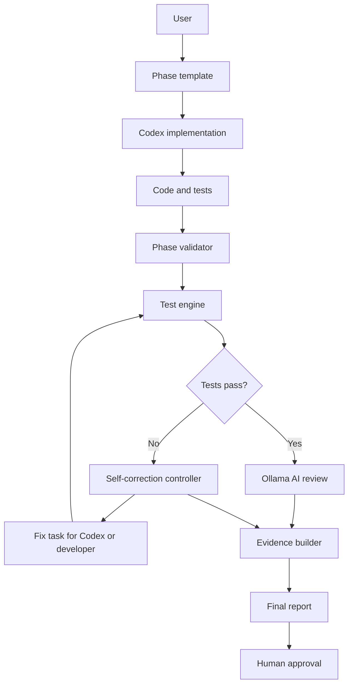

# AI Software Factory Architecture

## System Overview

The AI Software Factory is a reusable engineering workflow that connects Codex implementation, automated tests, AI review, self-correction, n8n orchestration, and human approval into one repeatable phase process.

It is an engineering assistant. It does not deploy production, merge branches, or approve releases by itself.

## Component Relationship

## Workflow Lifecycle

1. A phase prompt is saved under `docs/codex-prompts/`.
2. Codex implements the requested files and tests.
3. `ai-factory/run_ai_factory.py --phase <phase>` validates required artifacts.
4. The runner executes phase tests.
5. Failed tests are routed to the existing self-correction controller.
6. Passing or blocked evidence is sent through the existing AI phase reviewer.
7. Evidence is packaged in `ai-factory/evidence/package.json`.
8. A final review report is generated under `docs/reviews/`.
9. A human reviewer decides whether the phase can be approved.

## AI Responsibility Boundaries

AI may:

- summarize evidence
- identify missing files
- explain test failures
- generate fix instructions
- produce review reports

AI must not:

- deploy production
- merge code
- bypass human approval
- hide failed tests
- create fake success evidence

## Human Approval Points

Human approval is required before:

- merging any branch
- creating a production release
- deploying to production
- accepting a blocked phase
- changing security or production infrastructure settings

## Reused Components

- `scripts/phase_validator.py`
- `ai-review/run_phase_review.py`
- `ai-review/retry_controller.py`
- `scripts/n8n_phase_trigger.py`
- `n8n/workflows/phase_automation_controller.json`
