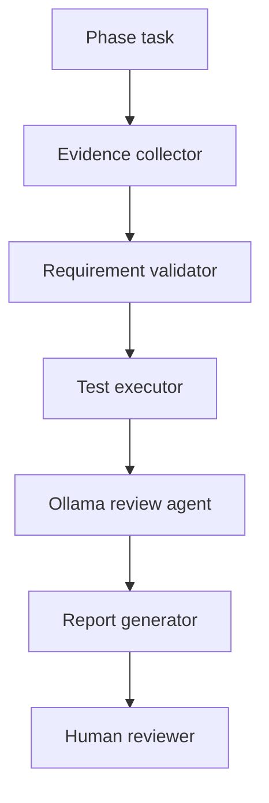

# AI Phase Review Engine Architecture

## System Purpose

The AI Phase Review Engine turns phase review into a repeatable local process.
It collects evidence, validates rules, runs tests, asks Ollama for advisory
analysis, and generates a final review report.

AI is not an approver. Human approval remains mandatory.

## Components



## Data Flow

1. `evidence_collector.py` reads Git metadata, changed files, phase prompt,
   existing reports, and log/evidence files.
2. `requirement_validator.py` checks required artifacts and safety rules.
3. `test_executor.py` runs project validation commands.
4. `ollama_phase_reviewer.py` sends compact evidence to local Ollama.
5. `report_generator.py` writes the final Markdown review report.
6. `run_phase_review.py` coordinates the full flow.

## Security Model

Rules:

- Do not call external AI APIs.
- Do not approve production deployment.
- Do not modify code automatically.
- Do not skip failed tests.
- Keep human approval mandatory.

Safety evidence is written to:

```text
ai-review/results/
```

## Future n8n Integration

n8n can trigger:

```text
python ai-review/run_phase_review.py --phase <phase>
```

n8n can collect:

```text
ai-review/evidence/current_phase.json
ai-review/results/rule_validation.json
ai-review/results/test_result.json
ai-review/results/ai_review.json
docs/reviews/PHASE_AI_REVIEW_REPORT.md
```

n8n still cannot approve production.
