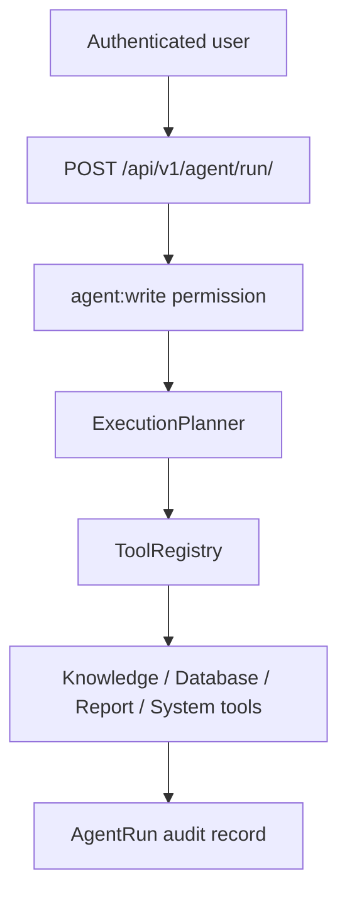

# AI Agent Architecture

## Goal

The agent layer lets authenticated users run local tools through a controlled
planner. It does not execute arbitrary code and does not call external AI APIs.

## Flow

## Tools

- `knowledge_search`: searches local RAG content.
- `database_summary`: returns safe model counts using Django ORM.
- `report_generator`: creates a JSON report skeleton.
- `system_information`: returns non-sensitive runtime metadata.

## Security

- Agent execution requires Bearer token authentication.
- Permission required: `agent:write`.
- No raw SQL is exposed.
- Tool output is deterministic and auditable.

