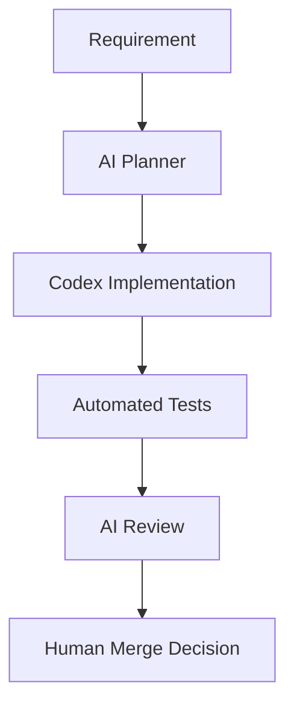

# AI Factory V2 Architecture

## Goal

AI Factory V2 extends the existing review workflow with specialized local AI
roles for safer software delivery.

## Roles

- Requirement Analyzer
- Code Reviewer
- Test Generator
- Documentation Generator

## Flow

## Safety

- AI cannot auto-merge.
- Human approval remains required.
- Failed tests cannot be hidden.
- Production deployment is outside this workflow.

