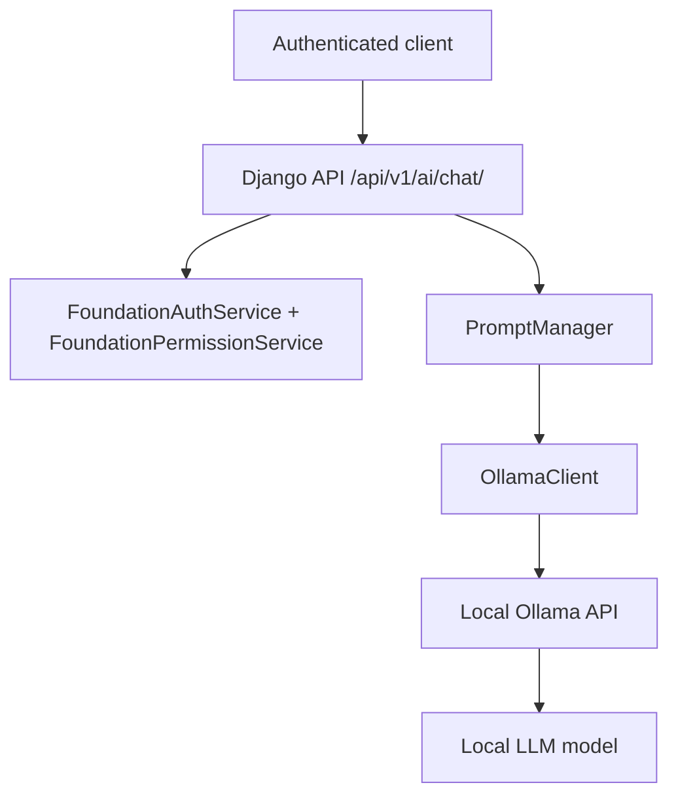

# AI Service Architecture

## Architecture

## Components

`apps.ai.views`

Receives HTTP requests, validates JSON input, checks Bearer token access, and
returns the standard project JSON envelope.

`PromptManager`

Normalizes the user message, enforces the message length limit, and builds the
system prompt. It does not store prompts or responses.

`OllamaClient`

Calls local Ollama endpoints:

- `GET /api/tags`
- `POST /api/generate`

It includes timeout handling, retry handling, invalid JSON protection, and safe
logging that avoids prompt content.

## Security

- Ollama remains local-only.
- No external AI API is called.
- Authentication is required.
- AI write permission is required.
- Prompt content is not persisted in Phase 1.

