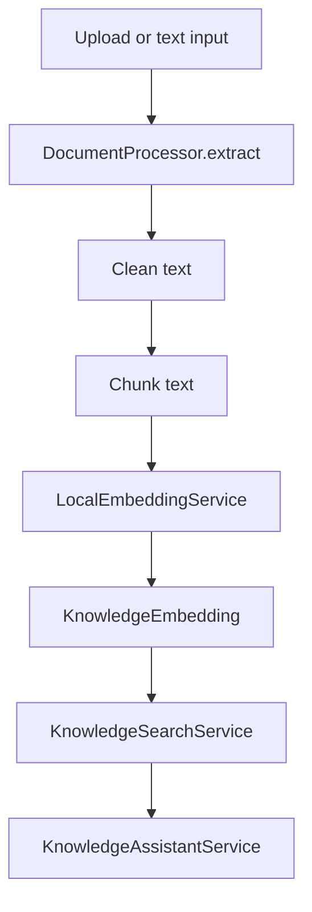

# Document Pipeline

## Flow

## Supported Sources

- TXT
- Markdown
- PDF best-effort extraction
- DOCX standard document XML extraction

## Indexing

`KnowledgeIndexer` replaces old chunks when a document is reindexed, creates a
`DocumentVersion`, then stores local deterministic embeddings.

## Assistant Behavior

The assistant retrieves context first. If documents exist but no relevant source
is found, it refuses to invent an answer. Every response includes:

- answer
- sources
- confidence
- warning

## Security

- Authentication is required.
- `knowledge:read` is required for search/chat.
- `knowledge:write` is required for document creation.
- Prompt-injection phrases are cleaned from source text.
- Ollama remains local.

