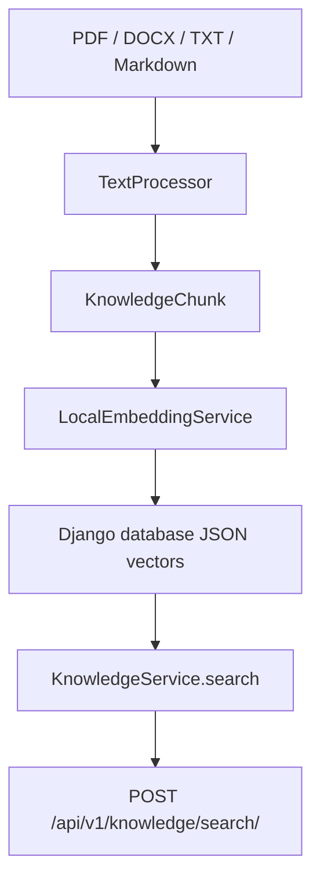

# RAG Architecture

## Goal

The RAG layer lets the local AI platform search MecPrecision knowledge before
answering business questions.

## Flow

## Current Vector Strategy

AI Wave 1 uses a deterministic local hash embedding. This keeps the platform
testable without external services. The service boundary allows a later switch
to pgvector or ChromaDB without rewriting the API.

## Security

- Knowledge search requires authentication.
- Permission required: `knowledge:read`.
- No document content is sent to paid or external AI APIs.

