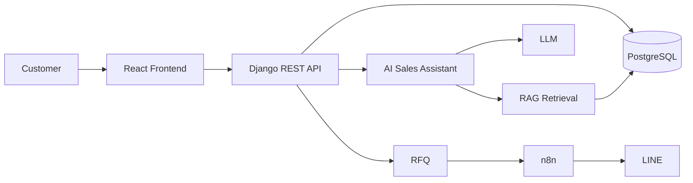
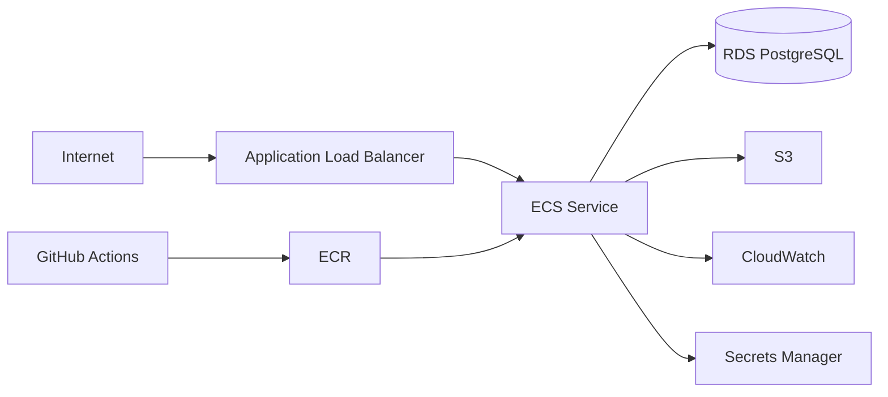

# Architecture

## Application architecture

## AWS-oriented staging / target architecture

The AWS diagram describes staging / target architecture, not a claim that every component is in production. Secrets and credentials must never be committed.
