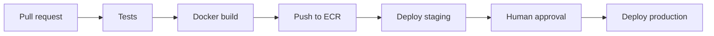

# AWS CI/CD Audit

## Current Status

CI exists, but AWS deployment automation is not implemented.

Evidence found:

- `.github/workflows/ci.yml`
- `.github/workflows/test_pipeline.yml`
- Docker build phase reports.
- Local deployment simulation docs.

## Current Pipeline

Current automation can:

- checkout source
- setup Python
- run tests
- build Docker image in CI
- upload test evidence

## Missing AWS Delivery Steps

No evidence found for:

- ECR push.
- ECS service update.
- Elastic Beanstalk deployment.
- EC2 SSH/systemd deployment.
- Terraform plan/apply.
- CloudFormation deployment.
- GitHub OIDC role assumption.

## Recommendation

Recommended pipeline:

Use GitHub Actions OIDC to assume an AWS deployment role instead of storing long-lived AWS keys.
