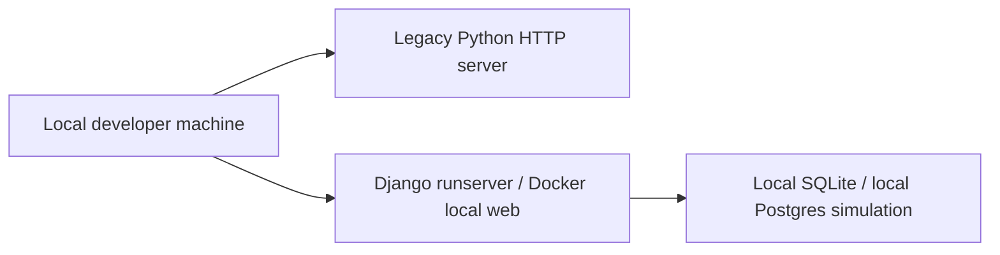

# AWS Compute Audit

## Current Status

No real AWS compute inventory is present in this repository.

Evidence found:

- `Dockerfile` defines a local Python 3.12 container.
- `docker-compose.yml` defines local `web`, `database`, and `redis` services.
- `docs/deployment/DEPLOYMENT_ARCHITECTURE.md` states production deployment is not implemented.
- `backend/app.py` still supports legacy local HTTP server runtime.
- Django can run with `python django_backend/manage.py runserver`.

## Current Architecture

## Django Runtime Location

Current Django runtime is local or local Docker simulation.

No EC2, ECS, Elastic Beanstalk, App Runner, Lambda, or EKS configuration was found.

## Legacy Runtime Location

Legacy runtime remains `backend/app.py`, commonly served locally on port `8000`.

## Recommendation

For AWS production, use one of these patterns:

1. ECS Fargate with Application Load Balancer.
2. Elastic Beanstalk for simpler first deployment.
3. EC2 with systemd/Gunicorn/Nginx only if operations are intentionally manual.

Preferred target: ECS Fargate + ALB because the project already has Docker groundwork.
