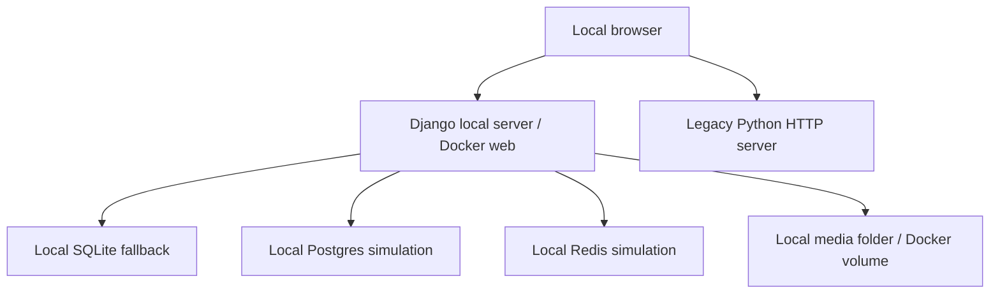
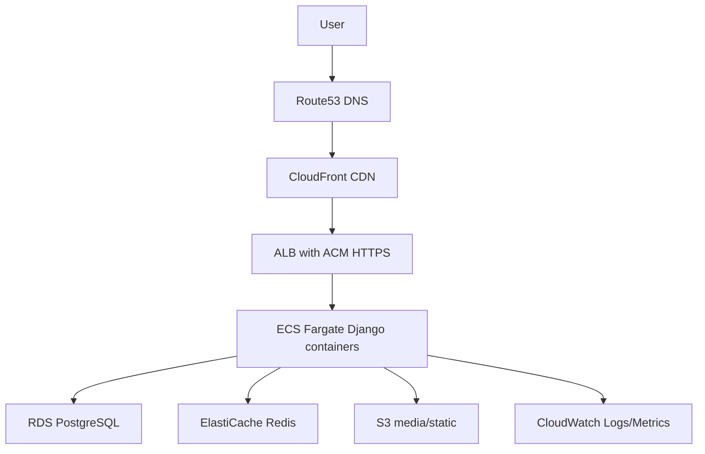

# AWS Current Architecture

## Current Architecture Summary

The project is AWS-ready at planning and local simulation level, but no real AWS infrastructure is currently represented in the repository.

## Current Flow

## Intended AWS Flow

## AWS Components

| Component | Current status |
| --- | --- |
| Compute | Not provisioned |
| Database | Local only; RDS not provisioned |
| Storage | Local media/static; S3 not provisioned |
| Networking | Nginx sample only; Route53/ALB/CloudFront not provisioned |
| Security | App-level controls exist; AWS IAM/security groups not documented |
| CI/CD | Test/build pipeline exists; AWS deploy pipeline missing |
| Monitoring | Local docs/checks exist; CloudWatch not provisioned |

## Main Risks

- No production AWS inventory.
- No RDS backup evidence.
- No AWS secret management.
- No CDN/static/media strategy implemented.
- No deployment role/pipeline to AWS.

## Improvement Recommendations

1. Choose ECS Fargate or Elastic Beanstalk target.
2. Create Terraform or CloudFormation baseline.
3. Add RDS PostgreSQL in private subnets.
4. Add S3/CloudFront for static/media.
5. Add GitHub Actions OIDC to AWS.
6. Add CloudWatch logs, metrics, alarms.
