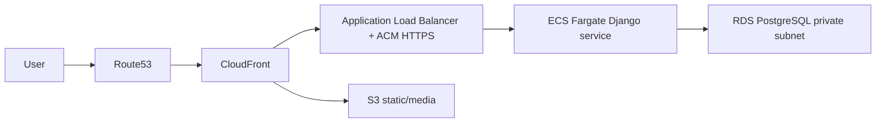

# AWS Network Audit

## Current Status

No Route53 hosted zone, DNS record export, Load Balancer configuration, CloudFront distribution, or ACM certificate evidence was found.

Evidence found:

- `nginx/nginx.conf` is a sample reverse proxy configuration.
- `.env.example` references production domain and CDN base URL placeholders.
- Django production settings enforce HTTPS-related flags.

## Domain

No real production domain configuration is present in the repository.

## Load Balancer

No ALB/NLB configuration is present.

## CloudFront

No CloudFront distribution configuration is present.

## SSL / HTTPS

Django production settings include:

- `SECURE_SSL_REDIRECT`
- secure session cookie
- secure CSRF cookie
- HSTS
- `X_FRAME_OPTIONS = DENY`

These are application-level readiness controls, not proof of ACM/ALB HTTPS setup.

## Recommendation

Target network architecture:

