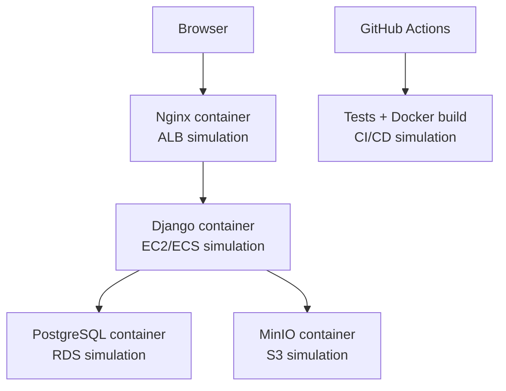
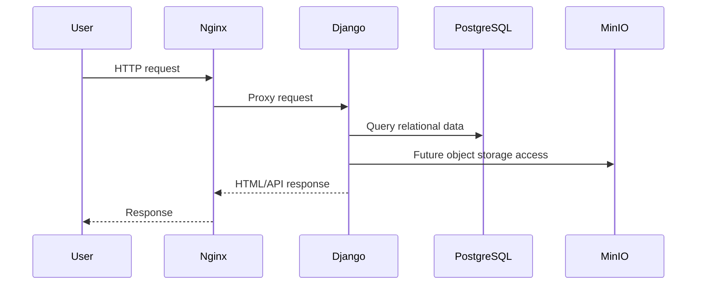

# AWS Learning Architecture

## Complete Local Architecture

## Request Flow

1. Browser opens `http://localhost:8088/`.
2. Nginx receives the request.
3. Nginx forwards to Django.
4. Django renders public pages or APIs.
5. Django reads/writes local database or storage simulation as needed.

## Data Flow

## AWS Equivalent Mapping

| AWS service | Local service |
| --- | --- |
| EC2 / ECS | Django container |
| RDS PostgreSQL | PostgreSQL container |
| S3 | MinIO |
| ALB | Nginx |
| GitHub Actions deployment | GitHub Actions lab workflow |

## Safety Boundary

This lab is local only. It does not require AWS credentials and does not create
cloud resources.
