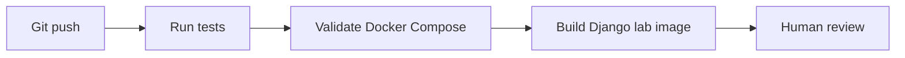

# CI/CD Simulation

## AWS Concept

CI/CD builds, tests, and deploys application changes. In AWS this often means:

```text
GitHub Actions -> ECR -> ECS / Elastic Beanstalk / EC2
```

## Local Lab Equivalent

Workflow:

`.github/workflows/aws-lab-ci.yml`

## Pipeline Flow



## What It Does Not Do

- It does not push to ECR.
- It does not deploy ECS.
- It does not create AWS resources.
- It does not spend money.

## Learning Outcome

You learn the shape of a deployment pipeline safely before connecting AWS.
