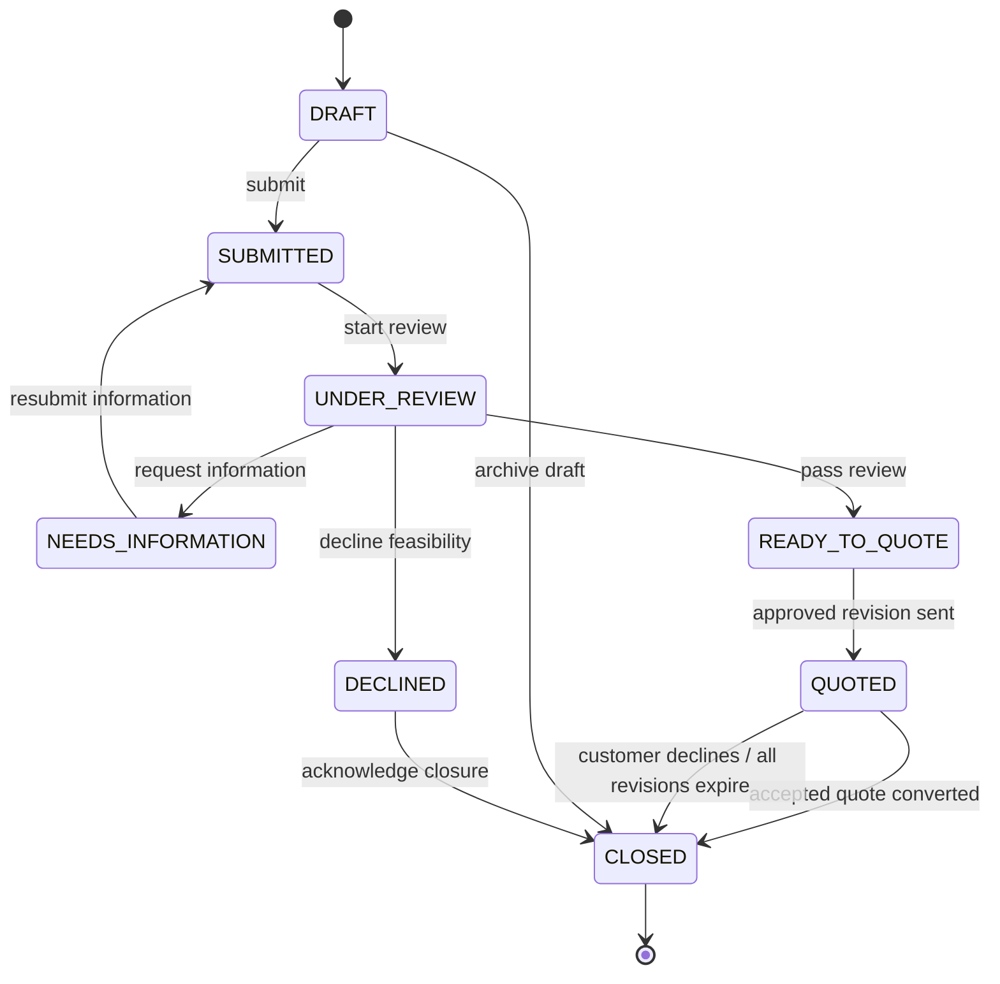
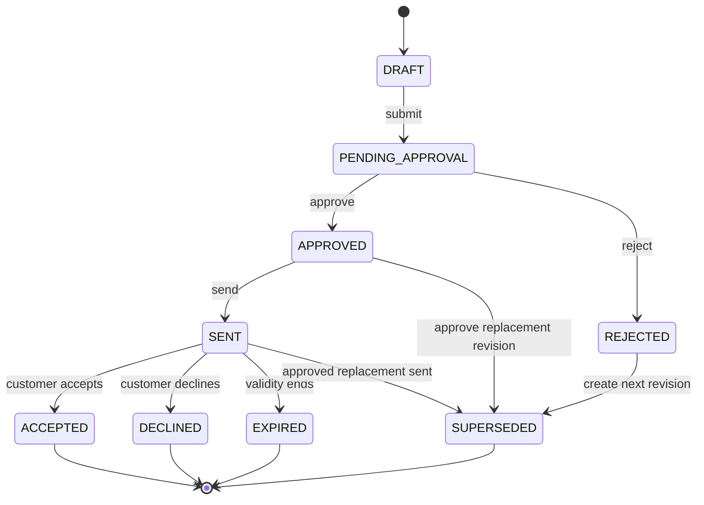
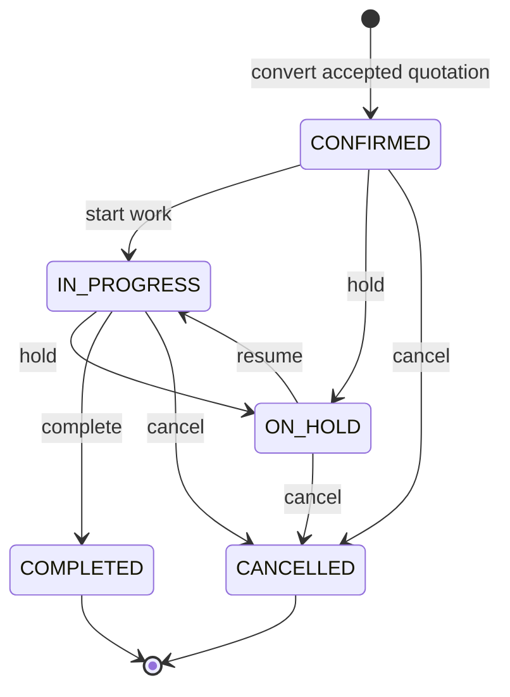
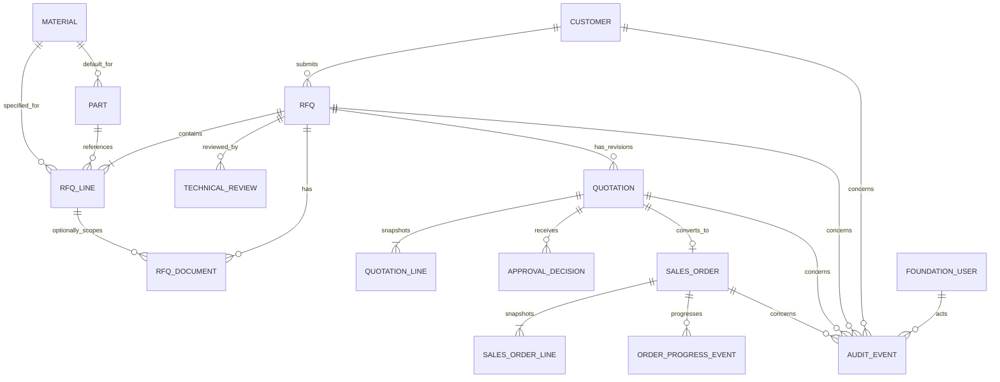

# Mini Enterprise Business Specification V1

Status: **APPROVED DESIGN CONTRACT FOR PHASES 3, 4, AND 6**
Scope: portfolio-grade internal workflow for a precision-machining company
Canonical backend: `django_backend/`
Canonical frontend: `figma_make_frontend/`

This document is the business source of truth for the next implementation
phases. Where it conflicts with current prototype code, this document defines
the target behavior; the gap matrix identifies the required future change.
Nothing in this document claims that a target capability is already implemented.

## 1. Product objective

The MVP manages the traceable commercial flow:

> Customer → RFQ → Technical Review → Quotation → Manager Approval → Customer
> Decision → Sales Order → Progress → Completion

It should demonstrate realistic ownership, validation, approvals, immutable
commercial snapshots, role separation, and auditability without becoming a full
ERP or MES.

## 2. MVP scope

The required MVP capabilities are:

1. Authentication and active-user enforcement.
2. Role-based access control for Admin, Sales, and Manager.
3. Customer management.
4. Product/Part management.
5. Basic material master.
6. RFQ header, lines, and secure documents.
7. Simple technical review performed by Manager.
8. Quotation and quotation revisions.
9. Manager approval with maker-checker separation.
10. Customer acceptance or rejection.
11. Sales order conversion from an eligible accepted quotation.
12. Coarse order progress tracking.
13. Dashboards calculated from persisted business data.
14. Basic append-only audit trail.
15. Safe RFQ/drawing upload with version metadata.

Existing lead, opportunity, CRM interaction, public CMS, inventory, knowledge,
and AI modules may coexist, but they are not prerequisites for the core flow.

## 3. Explicitly out of scope

The following are `DEFERRED`: full accounting; online payment; complete
procurement/vendor management; multilevel BOM; detailed routing or MES; machine
scheduling; machine maintenance; full QC/NCR/CAPA; complex logistics; machine
learning forecasts; image defect recognition; AI training/fine-tuning;
multi-agent AI; Kubernetes; and completion of all prototype screens.

Existing code for inventory, lead/opportunity, CMS, knowledge, AI, n8n, and
production operations is not deleted. It must not expand Phase 3/4/6 scope.

## 4. Terms and canonical names

| Term | Canonical meaning | Current aliases/conflicts |
| --- | --- | --- |
| Customer | Legal/business customer receiving quotations and orders | Legacy `crm.Customer`; managed `business_core.BusinessCustomer` |
| Part | A controlled manufacturable product/part master | Legacy `catalog.Product`; managed `business_core.BusinessProduct`; UI says product/SKU |
| Material | Basic material master referenced by a Part or RFQ line | Only unmanaged legacy `catalog.Material` exists |
| RFQ | Customer Request for Quotation, before commercial pricing | Legacy `sales.QuoteRequest`; current UI sometimes calls contact request or quote |
| RFQ line | One requested part, quantity, material, drawing revision, and delivery need | Legacy `QuoteRequestItem` |
| Technical Review | Manager decision that RFQ technical data is sufficient and feasible | No canonical persisted entity exists |
| Quotation | Commercial proposal for one RFQ | Managed `sales.SalesQuotation`; legacy “quote request” is not a quotation |
| Revision | Immutable commercial version `R0`, `R1`, … under one quotation family | Current `version` integer has no RFQ-family invariant |
| Sales Order | Internal confirmed order created from one accepted quotation revision | Current `transaction_domain.TransactionOrder` can be created directly |
| Progress | Coarse milestone/status of the sales order | Current order status is `new/approved/processing/completed/cancelled` |
| Archive | Logical retirement while preserving references and history | Current transactional hard-delete policy is not explicit |

Canonical API and UI language must use **RFQ** for the request and **Quotation**
for the priced offer. Database primary keys are internal and never replace
business codes.

## 5. Actors and roles

### Admin

Manages users, roles, and master data; can view all business records and audit.
Admin may perform operational actions only through the same transition services
and invariants as other roles. Admin cannot rewrite approval history, bypass
maker-checker separation, or silently unlock immutable snapshots.

### Sales

Owns customer intake, RFQ creation/submission, quotation drafting and submission,
sending approved quotations, recording customer decisions, and converting an
eligible accepted quotation to an order. Sales cannot approve or reject a
quotation they created, and cannot perform technical review in the MVP.

### Manager

Performs technical review, approves/rejects quotations, views all RFQs/orders and
dashboards, and changes coarse order progress. Manager cannot edit locked
commercial history. A Manager who created a quotation cannot approve it.

**Portfolio scope decision:** Manager also acts as technical reviewer; there is
no separate Engineer role in V1.

Current `admin/editor/viewer` roles in
`django_backend/apps/foundation/migrations/0002_seed_foundation_from_legacy.py`
do not satisfy this contract. Phase 3 must define/migrate canonical roles without
rewriting prior audit records.

## 6. Permission matrix

Legend: `Y` allowed; `Own` only records owned/created by Sales while editable;
`N` denied; `A` archive only (no hard delete); `System` atomic domain service.

| Resource/action | Admin | Sales | Manager | Constraints |
| --- | ---: | ---: | ---: | --- |
| Users/roles — list/view | Y | N | N | Security administration |
| Users/roles — create/update/deactivate | Y | N | N | Cannot edit historic actor identity |
| Customer — list/view | Y | Y | Y | Active authenticated users |
| Customer — create/update | Y | Y | N | Update blocked only by field-level locks, not transaction presence |
| Customer — delete/archive | A | A | N | Hard delete denied once any RFQ/order exists |
| Part/material — list/view | Y | Y | Y | Master data |
| Part/material — create/update/archive | Y | N | N | Sales may reference, not administer |
| RFQ — list/view | Y | Y | Y | Sales can see all in MVP; ownership retained for audit |
| RFQ — create/update | Y | Own | N | Only while `DRAFT` or permitted information correction |
| RFQ — delete/archive | A | Own | N | Only draft can be archived; transacted RFQ cannot hard-delete |
| RFQ — submit | Y | Own | N | Requires customer, ≥1 valid line, required technical data |
| Technical review — record/request information/complete | N | N | Y | Manager records reason/notes and immutable decision event |
| Quotation — list/view | Y | Y | Y | All revisions visible internally |
| Quotation — create revision/update | Y | Own | N | Only draft revision editable; no in-place edit after submission |
| Quotation — delete/archive | A | Own | N | Draft only; submitted/sent revisions retained |
| Quotation — submit | Y | Own | N | Requires balanced backend totals and RFQ `READY_TO_QUOTE` |
| Quotation — approve/reject | N* | N | Y | `*` Admin does not substitute for Manager; creator cannot decide |
| Quotation — send | Y | Own | N | Only `APPROVED`; records sent timestamp and snapshot |
| Customer decision — accept/decline | Y | Own | N | Only `SENT`; Sales records evidence, date, and reason when declined |
| Convert accepted quotation to order | Y | Own | N | `System` enforces eligibility and one-order invariant |
| Sales order — list/view | Y | Y | Y | Financial snapshot visible according to role |
| Sales order — create | N | N | N | Only quotation conversion service creates it |
| Sales order — update commercial fields | N | N | N | Correct via controlled amendment outside V1, not direct edit |
| Sales order — change progress | Y | N | Y | Only valid state transitions; reason required for hold/cancel |
| Sales order — delete/archive | N | N | N | Terminal records retained; no hard delete |
| Dashboard — view | Y | Y | Y | Role-appropriate persisted metrics |
| Audit log — view | Y | N | Y | Sales sees entity timeline through records, not global audit export |
| Audit log — update/delete | N | N | N | Append-only |
| RFQ document — upload/version | Y | Own | N | Secure validation and RFQ ownership |
| RFQ document — download | Y | Y | Y | Authorization checked on every request |

Phase 4 permissions must use action-specific codes such as `rfq:submit` and
`quotation:approve`, not collapse all mutations into `write`. Endpoint checks,
service checks, and UI affordances must agree; service checks are authoritative.

## 7. End-to-end workflow

1. Sales creates or selects an active Customer.
2. Sales creates an RFQ in `DRAFT`, adds at least one RFQ line, and uploads any
   drawings/specifications as versioned documents.
3. Sales submits the valid RFQ. It becomes `SUBMITTED` and is locked against
   ordinary line edits.
4. Manager starts technical review (`UNDER_REVIEW`).
5. Manager either requests information (`NEEDS_INFORMATION`), declines it
   (`DECLINED`), or confirms feasibility (`READY_TO_QUOTE`).
6. Sales creates Quotation revision `R0`, with line snapshots and backend totals.
7. Sales submits the revision (`PENDING_APPROVAL`).
8. A different Manager approves or rejects it. Rejection requires a reason.
9. Rework after rejection creates `R1`; `R0` stays immutable and becomes
   `SUPERSEDED` only when the replacement revision is approved.
10. Sales sends only an `APPROVED` revision; it becomes `SENT` with a frozen
    snapshot and validity dates.
11. Sales records the customer's `ACCEPTED` or `DECLINED` decision against the
    sent revision and retains decision evidence.
12. Sales atomically converts one eligible `ACCEPTED` revision to one Sales
    Order. The RFQ becomes `CLOSED` and source references/snapshots are retained.
13. Manager progresses the order through production-level milestones, may place
    it `ON_HOLD` with a reason, and completes or cancels it with audit.
14. Dashboard metrics and audit timelines derive from committed records, not
    hard-coded values.

## 8. RFQ state machine



### RFQ transition table

| From | To | Actor | Preconditions and effects |
| --- | --- | --- | --- |
| — | `DRAFT` | Sales/Admin | Active customer selected; unique RFQ code allocated |
| `DRAFT` | `SUBMITTED` | Sales/Admin | ≥1 valid line; quantities >0; dates valid; required technical description/document present; audit submit |
| `SUBMITTED` | `UNDER_REVIEW` | Manager | Reviewer is active; review record opened |
| `UNDER_REVIEW` | `NEEDS_INFORMATION` | Manager | Missing-data reason and requested fields required |
| `NEEDS_INFORMATION` | `SUBMITTED` | Sales/Admin | Requested data supplied; document replacement creates a new version; audit resubmit |
| `UNDER_REVIEW` | `READY_TO_QUOTE` | Manager | Every line feasible; required material/drawing revision resolved; review note stored |
| `UNDER_REVIEW` | `DECLINED` | Manager | Feasibility/strategic decline reason required |
| `READY_TO_QUOTE` | `QUOTED` | System | At least one approved quotation revision has been sent; no arbitrary caller transition |
| `QUOTED` | `CLOSED` | System | Accepted revision converted to order, or final customer decline/all revisions expired; closure reason stored |
| `DRAFT` | `CLOSED` | Sales/Admin | Archive/cancel unused draft with reason; no hard delete |
| `DECLINED` | `CLOSED` | Manager/Admin | Decline acknowledged; reason retained |

Editable rules: full edit in `DRAFT`; only requested fields/documents in
`NEEDS_INFORMATION`; all other states lock header/lines except controlled status
commands and non-destructive notes. Missing drawings are permitted only when a
line's technical description is sufficient and Manager explicitly records that
a drawing is not required. Otherwise it cannot reach `READY_TO_QUOTE`.

## 9. Quotation state machine



### Quotation transition table

| From | To | Actor | Preconditions and effects |
| --- | --- | --- | --- |
| — | `DRAFT` | Sales/Admin | RFQ is `READY_TO_QUOTE`; next unique revision allocated atomically; line snapshots copied |
| `DRAFT` | `PENDING_APPROVAL` | Sales/Admin | ≥1 line; decimal totals recalculate and balance; currency/dates valid; draft becomes immutable |
| `PENDING_APPROVAL` | `APPROVED` | Manager | Reviewer differs from creator; decision timestamp/actor stored |
| `PENDING_APPROVAL` | `REJECTED` | Manager | Reviewer differs from creator; non-empty rejection reason required |
| `REJECTED` | `SUPERSEDED` | System | Sales creates next revision; rejected revision remains immutable |
| `APPROVED` | `SENT` | Sales/Admin | Still within validity window; sent timestamp, recipient/evidence, and immutable snapshot stored |
| `APPROVED` | `SUPERSEDED` | System | A newer revision is approved before this one is sent |
| `SENT` | `ACCEPTED` | Sales/Admin | Customer decision evidence and timestamp; not expired; no other effective revision |
| `SENT` | `DECLINED` | Sales/Admin | Customer decline reason/evidence and timestamp required |
| `SENT` | `EXPIRED` | System/Manager | Current time exceeds `valid_until`; cannot accept or convert |
| `SENT` | `SUPERSEDED` | System | New approved revision is sent; old sent revision loses effect |

Only one revision per RFQ may be effective (`APPROVED`, `SENT`, or `ACCEPTED`)
at a time. A replacement approval/sending operation must lock the quotation
family and supersede the prior effective revision atomically. `ACCEPTED` is
terminal and cannot be superseded after order conversion. Sent content is never
edited in place.

## 10. Sales Order state machine



### Sales Order transition table

| From | To | Actor | Preconditions and effects |
| --- | --- | --- | --- |
| — | `CONFIRMED` | System | Source revision is `ACCEPTED`, not expired at acceptance, has no order; atomic unique conversion and snapshots |
| `CONFIRMED` | `IN_PROGRESS` | Manager/Admin | Expected delivery date set; start event audited |
| `CONFIRMED` | `ON_HOLD` | Manager/Admin | Non-empty hold reason required |
| `CONFIRMED` | `CANCELLED` | Manager/Admin | Non-empty cancellation reason required |
| `IN_PROGRESS` | `ON_HOLD` | Manager/Admin | Non-empty hold reason required |
| `IN_PROGRESS` | `COMPLETED` | Manager/Admin | Completion timestamp; all required coarse progress checks complete |
| `IN_PROGRESS` | `CANCELLED` | Manager/Admin | Non-empty cancellation reason required |
| `ON_HOLD` | `IN_PROGRESS` | Manager/Admin | Resume reason/note retained; prior hold remains in history |
| `ON_HOLD` | `CANCELLED` | Manager/Admin | Non-empty cancellation reason required |

`COMPLETED` and `CANCELLED` are terminal. No transactional order is hard-deleted.
MVP progress is the state plus optional integer percent (0–100) and a short
milestone note; it is not detailed routing, scheduling, or MES.

## 11. Business invariants

### Customer

- `customer_code` is required and globally unique (`CUS-0001`).
- `company_name` is required; a contact name does not substitute for it.
- Email uses syntactic validation; phone is normalized and validated to an
  agreed permissive international format. At least one contact channel is
  required for an active customer.
- Status is exactly `ACTIVE` or `INACTIVE`.
- A customer referenced by an RFQ/order cannot be hard-deleted; deactivate or
  archive instead.

### Product/Part and Material

- `part_code` is required and unique (`PART-0001`); name, controlled unit, and
  revision are required.
- Optional material FK points to the managed Material master; RFQ line may
  snapshot/override material when customer specification differs.
- Part stores simple tolerance and technical requirement text, not a BOM/routing.
- `material_code` is unique (`MAT-0001`); name and active state required;
  standard/grade are optional but recommended.
- Replacing a drawing creates a new document version/revision. Historic RFQ,
  quotation, and order snapshots keep the referenced version.

### RFQ

- `rfq_number` is unique (`RFQ-2026-0001`) and allocated server-side.
- Active Customer and at least one line are required before submit.
- Every line has quantity > 0, controlled unit, part description/code, and a
  delivery requirement.
- `required_delivery_date >= created_at.date()`.
- `quote_due_at` must be after submission and no later than required delivery;
  Manager may approve an exception with an audited reason.
- RFQ cannot reach `READY_TO_QUOTE` while required technical data, drawing
  revision, material, tolerance, or review decision is missing.

### Quotation and financial calculation

- `quotation_number` is unique and includes revision, e.g.
  `QT-2026-0001-R0`; internal family identity is separate from display code.
- It belongs to exactly one RFQ; each revision number is unique within RFQ.
- Quantity and unit price are decimal and > 0. Float is forbidden.
- Currency is an ISO 4217 code; MVP initially supports controlled `VND` and
  `USD`. One quotation has one currency.
- `valid_from` and `valid_until` are required and
  `valid_until >= valid_from`.
- Backend is the sole calculation authority:

```text
line_subtotal = quantity × unit_price
subtotal = sum(line_subtotal)
0 <= discount_amount <= subtotal
tax_amount >= 0
total = subtotal - discount_amount + tax_amount
total >= 0
```

- Client-supplied subtotal/total is ignored or rejected if inconsistent.
- Sent revision stores immutable customer, RFQ, line description, part code,
  quantity, unit, material, price, discount, tax, currency, terms, and validity
  snapshots. Later master-data changes do not alter it.
- Rejection reason is required. Rework creates the next revision; it never
  mutates the rejected/sent revision.
- An expired revision cannot be accepted or converted.

### Sales Order

- Only the conversion service creates an order, from an `ACCEPTED` quotation
  that was valid when acceptance was recorded.
- A database uniqueness constraint makes source quotation revision → order
  one-to-zero-or-one; retries return the existing result or a conflict, never a
  duplicate.
- `order_number` is unique (`SO-2026-0001`). Source RFQ, quotation family, and
  revision are retained.
- Line and financial snapshots are copied atomically from the accepted revision.
- `ordered_at` and `expected_delivery_date` are required;
  `expected_delivery_date >= ordered_at.date()`.
- Confirmed financial/source fields are immutable. V1 does not support arbitrary
  financial amendments.
- Hold and cancellation require reasons; completion stores timestamp.

### Authentication and authorization

- Inactive users cannot authenticate or execute transitions.
- Authorization is checked at API/UI boundary and again in domain services.
- Maker-checker compares stable user IDs, not names/emails.
- No role, including Admin, edits or deletes prior approval/audit rows.
- Concurrent transition/number/revision/conversion operations use transactions,
  row locks, and database constraints.

### Secure RFQ documents

- Document is linked to RFQ and optionally RFQ line; original filename is
  metadata only and never used as a storage path.
- Allowlist extensions/MIME types for portfolio scope: PDF, STEP/STP, DXF, and
  XLSX; reject executable, script, macro-enabled, path traversal, double-extension,
  and content/type mismatch.
- Enforce size/count limits, generated storage names, authorization on download,
  and no public direct path.
- Store version number, document revision, checksum, size, MIME type, uploader,
  and timestamp. Replacements append a version; they do not overwrite history.
- Existing `knowledge` upload security may inform implementation, but generic
  KnowledgeDocument is not the RFQ attachment source of truth.

## 12. Conceptual entity model



### Required/nullability contract for Phase 3

| Entity | Required fields | Nullable/optional fields |
| --- | --- | --- |
| Customer | code, company name, status, created/updated metadata | contact person, email or phone individually, country, notes |
| Part | code, name, revision, unit, active flag | default material, tolerance, requirements, current drawing |
| Material | code, name, active flag | standard, grade, description |
| RFQ | number, customer, status, quote due, required delivery, creator/timestamps | project name, notes, assignee, closure reason |
| RFQ line | RFQ, line number, description, quantity, unit | part, material, tolerance, technical notes |
| RFQ document | RFQ, version, filename metadata, storage key, MIME, size, checksum, uploader/time | RFQ line, document revision, replaced version |
| Technical review | RFQ, reviewer, decision/status, time | notes; reason required conditionally |
| Quotation | RFQ, family/revision, number, status, currency, validity, totals, creator/timestamps | approval/customer decision fields until their events occur |
| Quotation line | quotation, line number, description snapshot, quantity, unit price, line subtotal | source RFQ line/part, material snapshot |
| Approval decision | quotation revision, reviewer, decision, timestamp | reason required for rejection; notes optional |
| Sales order | number, source RFQ/quotation, customer snapshot, status, ordered/delivery dates, totals | hold/cancel/completion metadata conditionally |
| Sales order line | order, source quotation line, all commercial/part snapshots | internal production note |
| Audit event | actor ID, action, entity type/ID, timestamp | old/new status, reason, structured metadata |

All mutable business entities use `created_at`, `updated_at`, `created_by`, and
`updated_by` where meaningful. Immutable event/snapshot rows use creator/actor
and `created_at` only.

## 13. Data conventions

| Concept | Convention |
| --- | --- |
| Customer | `CUS-0001` |
| RFQ | `RFQ-2026-0001` |
| Quotation revision | `QT-2026-0001-R0`, then `R1` |
| Sales Order | `SO-2026-0001` |
| Part | `PART-0001` |
| Material | `MAT-0001` |
| Internal IDs | Database PK only; never the displayed business identifier |
| Datetime storage | Timezone-aware UTC through Django; never text dates for new entities |
| API datetime | ISO 8601 with timezone, e.g. `2026-09-08T10:30:00+09:00` |
| Money | Decimal fields plus ISO 4217 currency; no float |
| Unit | Controlled enum initially `PCS`, `KG`, `M`, `MM` |
| Status | Uppercase canonical choices in this document; API emits exact tokens |
| Deletion | Master data archived/inactivated; transactional data never hard-deleted |

Number generation must be concurrency-safe and independent from database PK.
Gaps are acceptable; duplicates are not. Codes are immutable after creation.

## 14. Audit requirements

Audit is append-only. Minimum fields: stable actor ID and display snapshot,
action, entity type, entity ID, timezone-aware timestamp, old status, new status,
and reason when required. Structured non-sensitive metadata may include source
revision and request correlation ID. Never log passwords, tokens, document
content, or unnecessary customer personal data.

Required actions:

- `customer.created`, `customer.updated`, `customer.archived`
- `rfq.created`, `rfq.updated`, `rfq.submitted`, `rfq.resubmitted`
- `rfq.technical_review_started`, `rfq.information_requested`,
  `rfq.review_completed`, `rfq.declined`, `rfq.closed`
- `rfq.document_uploaded`, `rfq.document_versioned`
- `quotation.created`, `quotation.revision_created`, `quotation.submitted`
- `quotation.approved`, `quotation.rejected`, `quotation.sent`,
  `quotation.customer_accepted`, `quotation.customer_declined`,
  `quotation.expired`, `quotation.superseded`
- `order.converted`, `order.progress_changed`, `order.held`, `order.resumed`,
  `order.completed`, `order.cancelled`

Approval records and audit events are separate: approval is domain evidence;
audit records that the approval command occurred. Neither is mutable by Admin.

## 15. Error cases and API semantics

| Case | Expected domain result | Suggested HTTP result for Phase 4 |
| --- | --- | --- |
| Invalid/missing field | No write; field errors | `400` |
| Unauthenticated/inactive user | No disclosure or write | `401` |
| Authenticated but forbidden action | No transition | `403` |
| Entity absent | No write | `404` |
| Illegal state transition | Preserve old state; explain allowed transitions | `409` |
| Duplicate business code/revision/order conversion | Atomic rollback | `409` |
| Stale concurrent update | Require refresh/retry | `409` |
| Missing RFQ technical information | Remain/request `NEEDS_INFORMATION` | `422` or project-standard `400` |
| Financial formula mismatch | Reject client totals; backend remains authority | `400` |
| Expired quotation acceptance/conversion | Deny; optionally transition to `EXPIRED` | `409` |
| Unsafe upload | Store nothing; generic safe error; audit rejection metadata | `400`/`413`/`415` |

Phase 4 must choose one consistent validation envelope and preserve existing
fail-closed security behavior.

## 16. Acceptance scenarios

### Happy path

1. **Create customer:** Sales creates `CUS-0001` with company and valid contact.
   Expected: active Customer persisted; audit records creator.
2. **Create RFQ:** Sales creates `RFQ-2026-0001`, a positive-quantity line, and
   uploads a validated drawing version. Expected: `DRAFT`; secure metadata and
   checksum persisted.
3. **Submit RFQ:** Expected: `SUBMITTED`, lines locked, submit audit event.
4. **Start review:** Manager starts review. Expected: `UNDER_REVIEW`; reviewer
   and timestamp persisted.
5. **Complete review:** Manager confirms feasibility. Expected:
   `READY_TO_QUOTE`; technical decision immutable.
6. **Create quotation R0:** Sales creates `QT-2026-0001-R0`. Expected: `DRAFT`,
   snapshots and server totals recorded.
7. **Submit approval:** Expected: `PENDING_APPROVAL`, revision locked.
8. **Manager approves:** a different Manager approves. Expected: `APPROVED` and
   approval/audit evidence.
9. **Send:** Sales records sending. Expected: `SENT`; frozen commercial snapshot.
10. **Accept:** Sales records customer evidence before expiry. Expected:
    `ACCEPTED`.
11. **Convert:** Sales requests conversion. Expected: one `SO-2026-0001` in
    `CONFIRMED`; second retry does not create another order.
12. **Progress/complete:** Manager moves `CONFIRMED → IN_PROGRESS → COMPLETED`.
    Expected: ordered status history and completion timestamp.
13. **Dashboard/audit:** Expected: persisted counters reflect the flow and every
    required action appears in immutable audit.

### Negative paths

| Scenario | Expected result |
| --- | --- |
| Submit RFQ with no line | Reject; remain `DRAFT`; no partial writes |
| Technical data/drawing requirement missing | Manager uses `NEEDS_INFORMATION`; deny `READY_TO_QUOTE` |
| Sales approves own quotation | `403`/domain denial; remain `PENDING_APPROVAL`; denial auditable |
| Manager created quotation then approves it | Maker-checker denial identical to Sales creator case |
| Discount exceeds subtotal | Reject transaction; no quotation/revision saved |
| Calculated total would be negative | Reject; backend formula remains authoritative |
| Send unapproved quotation | Illegal transition; remain current state |
| Accept/convert expired quotation | Deny; mark/return `EXPIRED`; no order |
| Convert same quotation twice | Unique conflict/idempotent existing result; exactly one order |
| Unauthorized actor transitions any entity | Deny without state change |
| Edit sent quotation without revision | Deny; instruct creation of next revision |
| Reject quotation without reason | Deny; remain `PENDING_APPROVAL` |
| Hold/cancel order without reason | Deny; preserve current state |
| Jump RFQ `DRAFT → READY_TO_QUOTE` | Deny; required submit/review states cannot be skipped |
| Replace drawing in place | Deny overwrite; append a new document version |
| Upload executable disguised as drawing | Reject and store nothing |
| Hard-delete transacted customer/order | Deny; archive/inactivate where allowed |

## 17. Current implementation inventory and conflict analysis

### Models and services

- Managed identity/RBAC exists in `apps/foundation/models.py` and
  `services.py`, but roles/actions are legacy-oriented (`admin/editor/viewer`,
  wildcard/read/write).
- Managed Customer and Product exist in `apps/business_core/models.py` with
  service validation in `apps/business_core/services.py`. Customer company name
  is currently optional; Product lacks canonical part revision/unit/material FK.
- Unmanaged duplicate Customer/Product/Material/RFQ models remain in
  `apps/crm/models.py`, `apps/catalog/models.py`, and `apps/sales/models.py`.
- Managed CRM extension entities exist and link to BusinessCustomer.
- Managed SalesQuotation/Line exists in `apps/sales/models.py`; totals are
  calculated in `SalesPlatformService`, but it is opportunity/customer-based,
  not RFQ-based, permits zero unit price, has no tax/currency/validity/snapshot,
  and uses `draft/review/approved/sent/accepted/lost` plus a separate free-form
  `approval_status`.
- Managed TransactionOrder/Item, history, and approval exist in
  `apps/transaction_domain/models.py`. `OrderService.create_order` accepts direct
  customer/items and uses `ORD-*`; it has no source quotation constraint.
  Workflow permits `new/approved/processing/completed/cancelled` and creates an
  “approved” approval where requester and reviewer are the same actor.
- TransactionHistory is a useful audit foundation but optional actor strings and
  generic payloads do not yet satisfy stable actor/status/reason requirements.
- Generic secure-ish document functionality exists under `apps/knowledge`, but
  no RFQ document relation/version contract is implemented.

### APIs and server-rendered UI

- Current routes are listed in `apps/api/urls.py`. Useful managed endpoints
  include business customers/products, sales quotations/dashboard, orders,
  workflows, transactions, foundation auth/users/roles, and knowledge documents.
- Legacy read-only routes `sales/quotes/*` expose QuoteRequest data and conflict
  in terminology with managed `sales/quotations/`.
- No canonical managed RFQ, technical review, quotation decision/revision,
  quotation-to-order conversion, or progress-event API exists.
- Current permissions are mostly module `read/write`; `business_ui/views.py`
  checks `sales:approve`, but the reviewed permission migrations do not seed
  that action. This makes approval availability configuration-dependent and
  inconsistent with the desired roles.
- Django `admin_ui` and `business_ui` templates use real ORM/services for several
  customers, products, leads, quotations, orders, workflows, and dashboard
  values. They remain partial and expose current noncanonical workflows.

### React frontend

- `figma_make_frontend/src/App.tsx` defines local arrays for products/customers,
  static RFQ confirmation, dashboard metrics, quotation/order tables, login, and
  progress. It contains no API client/fetch call; interactions are presentation
  only.
- `figma_make_frontend/src/data/mock.ts` exports additional PRODUCTS, CUSTOMERS,
  ORDERS, LEADS, QUOTATIONS, and METRICS mock data, but it is not imported by the
  current `App.tsx`.
- Prototype labels conflict with this contract (`PO-*`, `QT-*` without revision,
  Vietnamese presentation statuses, QC/CAM/MES-like columns). Screens may be
  visually reused in Phase 6 only after API binding and canonical status mapping.

## 18. Gap matrix

| Capability | Current model | Current API | Current UI | Current tests | Status | Phase action |
| --- | --- | --- | --- | --- | --- | --- |
| Authentication | `foundation.FoundationUser/AuthToken` | `/api/v1/foundation/auth/*` | Django login real; React login mock | Foundation/API tests exist | `PARTIAL` | P3 retain source; P4 enforce active roles; P6 bind login |
| RBAC | Role/Permission with wildcard/read/write | Module checks; no complete action contract | Django hides some actions; React no enforcement | Permission compatibility tests | `CONFLICT` | P3 canonical Admin/Sales/Manager + action codes; P4 service enforcement; P6 affordances |
| Customer | Managed `BusinessCustomer`; duplicate legacy `crm.Customer` | Managed `/business/customers/` and CRM endpoints | Django real; React hard-coded | Service/API coverage present | `CONFLICT` | P3 retain BusinessCustomer, add code/company invariant/archive; map legacy IDs |
| Part/Product | Managed BusinessProduct; duplicate legacy Product | Managed business and legacy catalog endpoints | Django real; React hard-coded | Business/catalog tests | `CONFLICT` | P3 retain BusinessProduct as Part source, add revision/unit/material; P4 canonical naming |
| Material master | Only unmanaged `catalog.Material` | Legacy read-only `/catalog/materials/` | React/Django show material strings | Legacy ORM tests only | `MISSING` | P3 create managed Material and migration mapping; P4 CRUD; P6 selector |
| RFQ | Unmanaged QuoteRequest/Item/File only | Legacy `/sales/quotes/*`; replacement submission is not managed RFQ | Public/React RFQ form is mock; no managed internal screen | Legacy compatibility tests | `MISSING` | P3 create RFQ/line/document/review schema; P4 workflow API; P6 screens |
| Technical review | None | None | Text/process hints only | None | `MISSING` | P3 entity/decisions; P4 commands; P6 Manager review |
| Quotation revisions | Managed SalesQuotation/Line, but no RFQ FK/revision family | `/sales/quotations/` list/create only | Django real partial; React hard-coded | Some sales/platform tests outside reviewed core; no full state tests | `CONFLICT` | P3 refactor canonical source and snapshots; P4 revision/state endpoints; P6 bind |
| Manager approval | Free-form approval status; order WorkflowApproval is wrong domain | Business UI approve action; no canonical quotation approval API | Django approve button conditional | Partial permission/service tests | `CONFLICT` | P3 approval decision entity; P4 maker-checker approve/reject commands; P6 reason dialog |
| Customer decision | `handoff_quotation` directly sets accepted | No separate sent/accept/decline contract | Django “handoff” button | No complete state-machine coverage | `CONFLICT` | P3 decision evidence fields/event; P4 sent/accept/decline endpoints; P6 actions |
| Sales Order conversion | TransactionOrder created directly; no quotation FK | `/orders/` permits POST direct | Django direct create; React hard-coded | Transaction tests exist | `CONFLICT` | P3 source constraints/snapshots; P4 conversion-only creation; P6 disable direct form |
| Order progress | Status/history with old states | Generic `/workflows/` transition | Django real partial; React static percentages/CAM/QC | Transaction workflow tests | `PARTIAL` | P3 canonical statuses/reason/progress; P4 commands; P6 timeline |
| Dashboard | ORM-derived Django admin/sales metrics | Admin/sales dashboard endpoints | Django real partial; React all hard-coded | Endpoint/basic service coverage | `PARTIAL` | P4 core-flow metrics; P6 bind and remove claims unsupported by data |
| Audit trail | TransactionHistory, OrderStatusHistory, SalesActivity fragmented | `/transactions/` order-centric | Django tables partial; React mock | Some transaction tests | `CONFLICT` | P3 unified append-only AuditEvent; P4 entity timelines/global Manager view; P6 display |
| RFQ secure upload | Generic KnowledgeDocument/Version only; legacy QuoteFile metadata | Knowledge upload/download; legacy quote files read-only | Django knowledge upload real; React upload mock | Knowledge upload security tests exist | `PARTIAL` | P3 RFQDocument relation/version; P4 secure RFQ endpoints; P6 upload/version UI |
| Lead/opportunity | Managed SalesLead/Opportunity | Sales endpoints | Django real; React hard-coded | Existing coverage | `DEFERRED` | Preserve; optional link to Customer/RFQ after core MVP |
| Inventory | Managed warehouse/item/transaction | Inventory endpoints | Django real partial; React hard-coded | Existing coverage | `DEFERRED` | Do not couple to order conversion in MVP |
| CMS/public site | Legacy/managed content mix | Public/CMS endpoints | Django public real; React marketing mock | Existing compatibility tests | `DEFERRED` | Preserve; outside core contract |
| AI/knowledge assistant | Multiple existing models/services | AI/knowledge/agent endpoints | Django and React prototypes | Extensive existing tests | `DEFERRED` | No Phase 3/4/6 core dependency |

### Canonical source decisions

- Keep `BusinessCustomer` as the Customer base and `BusinessProduct` as the
  Part base; evolve them only in Phase 3 migrations.
- Create a managed Material source; legacy Material is import/reference input,
  not ongoing ownership.
- Create managed RFQ, RFQLine, RFQDocument, and TechnicalReview entities.
- Evolve or deliberately replace managed SalesQuotation/Line as the canonical
  quotation family; never use legacy QuoteRequest as a quotation.
- Evolve TransactionOrder/Item for source quotation snapshots and canonical
  state; direct order creation must be retired at API/UI level in Phase 4/6.
- Consolidate fragmented audit into one append-only canonical event contract,
  while retaining historic tables for migration/reference.

## 19. Mapping to implementation phases

### Phase 3 — database/domain persistence

1. Create managed Material, RFQ, RFQLine, RFQDocument/Version,
   TechnicalReview, quotation approval/decision, and unified AuditEvent schema.
2. Extend canonical Customer/Part with codes, revision/unit/material/archive and
   audit metadata.
3. Align quotation family/revision, financial, validity, currency, snapshot, and
   uniqueness fields.
4. Align SalesOrder source references, line snapshots, dates, progress/reasons,
   and one-order constraint.
5. Define exact choices and constraints matching this document; plan legacy
   mapping without changing source data.
6. Define canonical roles/action permissions without fabricating users or data.

### Phase 4 — API and domain commands

1. Add dedicated command services/endpoints for every state transition.
2. Enforce action-specific RBAC and maker-checker rules in services.
3. Make totals backend-only and conversion atomic/idempotent.
4. Add secure RFQ upload/version/download authorization.
5. Add list/detail/filter APIs and entity audit timelines.
6. Preserve or version legacy endpoints explicitly; remove terminology ambiguity
   without silent behavior changes.

### Phase 6 — frontend

1. Bind React to Phase 4 APIs and authenticated roles.
2. Implement only core Customer/Part/Material/RFQ/review/quotation/order/audit
   screens; reuse visual components where useful.
3. Replace hard-coded dashboards/tables and map exact canonical statuses.
4. Hide forbidden actions for usability while still relying on backend denial.
5. Implement accessible validation, conflict, upload, rejection, hold, and cancel
   flows. Do not complete unrelated prototype screens.

## 20. Portfolio scope decisions

- Manager doubles as technical reviewer; no Engineer role.
- Progress uses five coarse order states and optional percentage/note; no MES.
- Material master is basic; no purchasing, supplier, lot, heat, or full inventory
  workflow.
- Part has simple revision/material/tolerance/requirements; no multilevel BOM or
  routing.
- Quotation supports one currency per revision and simple subtotal/discount/tax;
  no payment, accounting, or exchange-rate engine.
- Customer decision is recorded internally by Sales with evidence; no customer
  portal/e-signature in V1.
- No amendment/change-order workflow after confirmation in V1; preserve records
  and handle exceptional correction through a future explicitly designed phase.
- Existing AI and extended operations modules are deferred and cannot become a
  dependency of the core flow.

## 21. Phase 3 readiness gate

Phase 3 may begin only if its implementation plan:

- names the canonical entities above and explicit legacy mappings;
- implements these exact states/transitions or records an approved spec revision;
- includes database constraints for unique codes, revisions, one-order
  conversion, positive quantities, and nonnegative money;
- preserves all current data and creates reviewed migrations only;
- includes tests for every invariant and negative acceptance scenario; and
- does not expand into deferred ERP/MES/AI scope.

With this contract, no unresolved business choice blocks database design.
Implementation details (table names, migration sequencing, and API envelope) may
be chosen in their designated phase as long as they preserve this contract.
