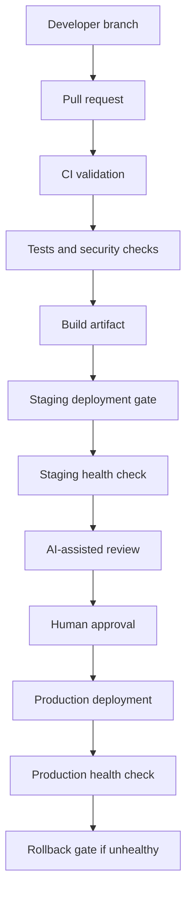

# CI/CD Architecture Design

## Purpose

This document defines the CI/CD blueprint for mecprecision-vietnam before any
real deployment automation is implemented.

The pipeline must protect production, keep human approval in the release path,
and reuse the existing migration validation foundation.

## Pipeline Overview



## Development Flow

1. Developer creates a feature, migration, or hotfix branch.
2. Code and documentation are committed with a clear conventional commit.
3. Pull request is opened against `develop` or release branch.
4. CI runs validation, tests, and documentation checks.
5. Human reviewer checks architecture and risk.

## Testing Flow

Mandatory checks:

- Django system check.
- Unit tests.
- Module tests for catalog, CRM, sales, CMS, and auth.
- Regression tests.
- Migration phase tests when phase work is present.
- Security and dependency checks when enabled.

Existing command foundation:

```powershell
pytest
powershell -ExecutionPolicy Bypass -File scripts/run_migration_test.ps1
```

## Build Flow

The build stage should create immutable artifacts:

- Django backend package or container image.
- Static frontend assets.
- Documentation artifacts.
- Review package artifacts.

Builds must include commit hash, branch, timestamp, and environment target.

## Deployment Flow

Deployment should be environment-gated:

1. Development deployment: automatic after CI pass.
2. Testing deployment: automatic or manual, depending on resource availability.
3. Staging deployment: manual approval required.
4. Production deployment: human approval required and protected.

No production deployment is implemented in Phase 13.0.

## Rollback Flow

Rollback must be planned before production implementation.

Rollback inputs:

- Previous successful artifact.
- Database backup or migration rollback plan.
- Route/proxy rollback plan.
- Health-check result.
- Incident owner approval.

Rollback must be manual until production safety is proven.

## Phase Boundary

Phase 13.0 is architecture design only. It does not create real CI secrets,
deploy infrastructure, or modify production systems.

