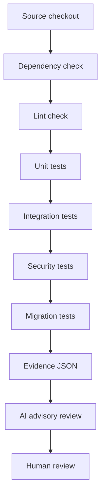

# Test Pipeline Architecture

## Purpose

Phase 13.2 turns the manual migration test routine into a repeatable pipeline
that can run locally and later inside CI.

## Test Workflow



## Test Stages

| Stage | Purpose | Required |
| --- | --- | --- |
| Dependency check | Confirm Python test dependencies import correctly. | Yes |
| Lint check | Run static checks when lint tooling is installed. | Warning only until lint tool is standardized. |
| Unit tests | Run focused Phase 13.2 tests. | Yes |
| Integration tests | Run Docker pipeline tests without production deployment. | Yes |
| Security tests | Run existing Phase 12.1 security tests. | Yes |
| Migration tests | Run the standard migration validation script. | Yes |

## Failure Handling

- Any required stage returning a non-zero exit code blocks the pipeline.
- Optional lint tooling can produce `WARN` when the tool is not installed.
- Failed command output is preserved in JSON evidence.
- No later deployment step is allowed in this phase.

## Evidence Generation

Primary evidence:

```text
docs/cicd/test_pipeline_result.json
```

The evidence includes:

- command
- duration
- status
- passed test count
- failed test count
- warning count
- safety flags

## CI Integration Point

The GitHub Actions example calls:

```text
python scripts/phase13_2_test_pipeline.py
```

CI should upload the JSON result as an artifact after the test run. Production
deployment is intentionally absent from this phase.
