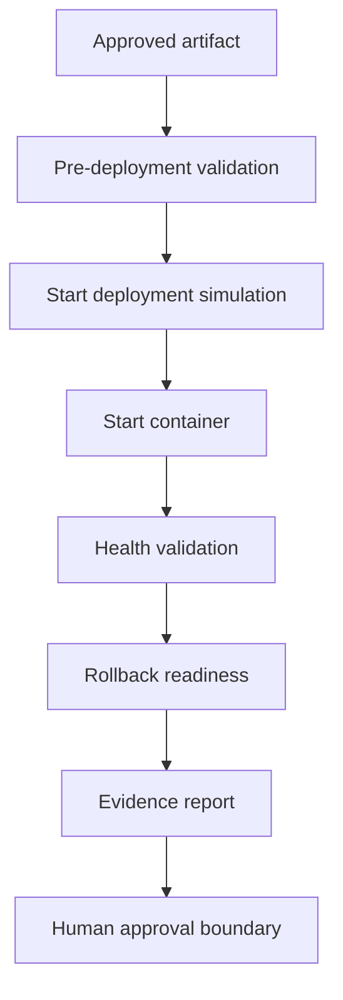
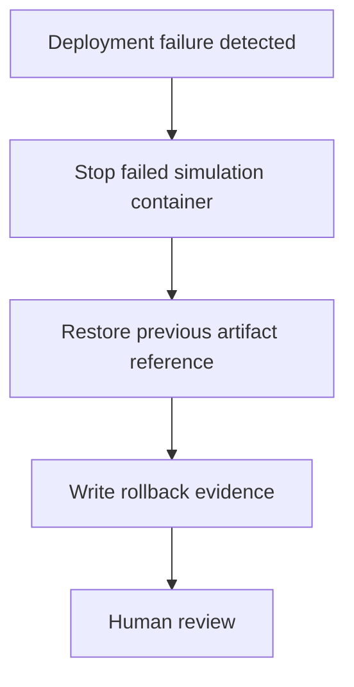

# Deployment Architecture

## Purpose

Phase 13.4 creates a safe deployment automation foundation. It validates the
deployment flow locally before any real staging or production automation is
introduced.

## Deployment Flow



## Environment Model

| Environment | Automation Level | Approval |
| --- | --- | --- |
| Local simulation | Automated | Developer review |
| Staging | Future automation | Human approval |
| Production | Not implemented in Phase 13.4 | Human approval required |

Production deployment is intentionally out of scope.

## Artifact Handling

Current artifact:

```text
mecprecision-vietnam:phase-13.1
```

Artifact evidence:

```text
docs/docker/docker_build_report.json
```

Deployment evidence:

```text
docs/deployment/deployment_result.json
docs/deployment/health_result.json
docs/deployment/rollback_result.json
```

## Approval Gate

Automation can prepare and validate. It cannot approve production.

Required human approval:

- staging promotion
- production deployment
- rollback execution in real environments

## Rollback Flow



Rollback capability must exist before deployment starts.
