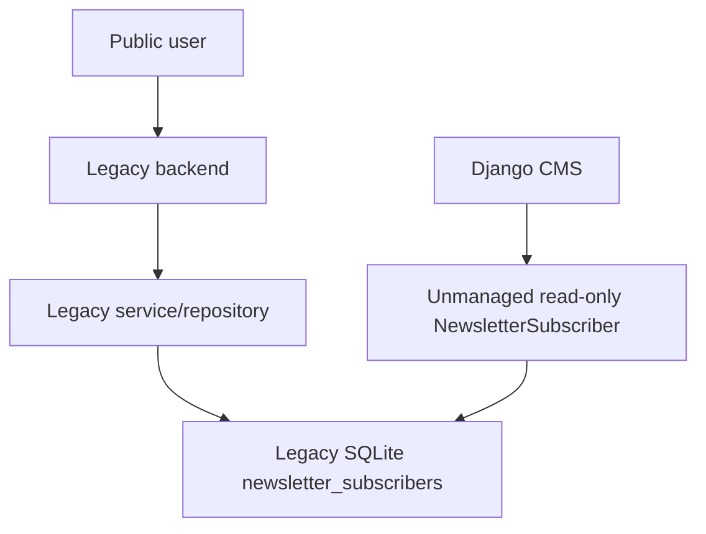
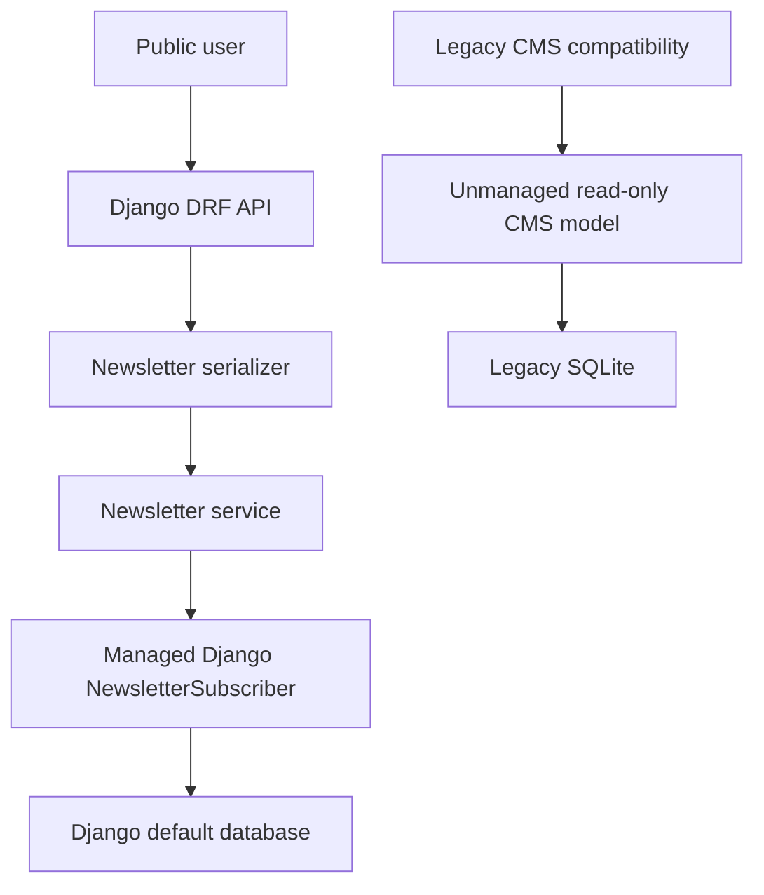

# Django Ownership Design

## Selected Domain

Newsletter subscribers.

## Before Architecture

Before Phase 14.1:

- Legacy owns the write path.
- Django can only read legacy subscriber records through unmanaged CMS models.
- Django does not own the schema or durable write flow.

## After Architecture

After Phase 14.1:

- Django owns new newsletter subscriptions.
- Django owns the managed newsletter model and migration.
- The legacy read-only CMS mapping remains for compatibility and audit comparison.

## Data Flow

1. Client posts email to `/api/v1/newsletter/subscribers/`.
2. DRF serializer validates email and optional source.
3. Newsletter service creates or reactivates the subscriber.
4. Managed Django model writes to the default Django database.
5. API returns a legacy-compatible success envelope.

## API Flow

| Method | Endpoint | Owner | Behavior |
| --- | --- | --- | --- |
| `GET` | `/api/v1/newsletter/subscribers/` | Django | List Django-owned subscribers |
| `POST` | `/api/v1/newsletter/subscribers/` | Django | Subscribe or reactivate an email |

## Service Ownership

New owner:

- `django_backend/apps/newsletter/services.py`

Compatibility retained:

- `django_backend/apps/cms/repositories/newsletter_repository.py`

## Ownership Boundary

Django owns new newsletter writes. Legacy backend remains present and is not removed in this phase.
