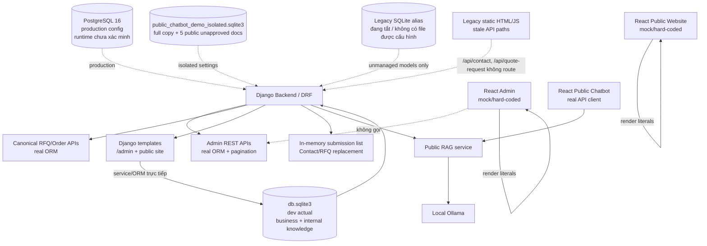

# SYSTEM DATA FLOW AUDIT

**Ngày audit:** 2026-09-20  
**Phạm vi:** Database, Django Backend/API, Admin, Public Website, RFQ/Contact và Public AI Chatbot trong working tree hiện tại.  
**Chế độ:** chỉ đọc. Không migration, không seed, không sửa/xóa database, không thay đổi code/UI.

## 1. Kết luận điều hành

Hệ thống hiện tại **không có một data flow thống nhất** từ database đến mọi giao diện.

- Frontend chính theo `README.md` là React/Vite tại `figma_make_frontend/src/App.tsx`. Public website và 7 màn hình Admin trong frontend này chủ yếu là demo hard-code.
- Django có API thật cho Product, Customer, Inventory, Order, Workflow và Transaction, nhưng các màn hình Admin React không gọi những API đó.
- Django còn có một bộ giao diện server-rendered tại `/admin/` và public website bằng templates. Đây là luồng thứ hai, đọc ORM/service trực tiếp, không phải UI React chính.
- Database development thực tế là `django_backend/db.sqlite3` (SQLite, 49,344,512 bytes). Production settings và Docker yêu cầu PostgreSQL 16, nhưng tại thời điểm audit không có service/port PostgreSQL hoặc Django đang chạy nên không thể khẳng định record count của một database production đang hoạt động.
- Public Contact/RFQ trên React không submit vì nút dùng `type="button"`. Form không gọi API. Nếu handler được kích hoạt bằng cách khác, nó vẫn chỉ hiện thông báo thành công giả và không lưu dữ liệu.
- API replacement cho Contact/RFQ chỉ ghi vào list trong memory của process, không ghi DB; restart sẽ mất toàn bộ submission.
- Public chatbot có hai trạng thái dữ liệu khác nhau: DB chính có 205 tài liệu nhưng tất cả là `internal`; DB demo cô lập có 5 bản sao `public`, mang trạng thái `isolated_demo_unapproved`. UI gọi cùng-origin API nên DB thực tế phụ thuộc backend được khởi động bằng settings nào.
- Trường hợp input vô nghĩa trả FAQ không liên quan, confidence khoảng 40% và tiếng Anh là hệ quả của hash embedding 32 chiều, threshold thấp ở development, không có kiểm tra “gibberish/out-of-domain”, confidence lấy trực tiếp từ top similarity, và prompt hệ thống viết bằng tiếng Anh nhưng không ép ngôn ngữ đầu ra.

## 2. Phương pháp và giới hạn xác minh

Đã kiểm tra source routing, settings, model, serializer, view/service, React handlers, Docker topology và đọc SQLite bằng kết nối `mode=ro`.

Không có listener trên các cổng 3000, 5173, 8000, 5432 hoặc 11434. Docker daemon không hoạt động. Vì vậy:

- `DB records` trong báo cáo là số đo trực tiếp từ hai file SQLite local vào ngày audit.
- `Frontend displayed` là số phần tử/giá trị được định nghĩa trong source React hiện tại, không phải ảnh chụp một runtime đang chạy.
- Không có truy vấn đến PostgreSQL production và không có call tới Ollama.
- Working tree đã có nhiều thay đổi chưa commit trước audit; báo cáo đánh giá đúng trạng thái working tree đó.

## 3. Database

### 3.1 Engine và topology

| Môi trường/nguồn | Engine | Vị trí/cấu hình | Trạng thái xác minh |
|---|---|---|---|
| Development mặc định | SQLite | `django_backend/db.sqlite3` qua `config/settings/base.py` | Có file, đọc được, là nguồn record count chính |
| Public chatbot demo cô lập | SQLite | `django_backend/public_chatbot_demo_isolated.sqlite3` qua `config/settings/public_chatbot_demo.py` | Có file, đọc được; cố ý cấm dùng chung path DB chính |
| Production/primary Compose | PostgreSQL 16 | `DATABASE_URL`, service `database` trong `docker-compose.yml` | Cấu hình bắt buộc; không có runtime đang chạy để đếm |
| Phase 6/6D | PostgreSQL 16 | service `postgres` trong `docker-compose.phase6.yml` | Cấu hình bắt buộc; Docker daemon không chạy |
| Legacy compatibility DB | SQLite, unmanaged/read-only | Chỉ bật khi `LEGACY_DATABASE_ENABLED=true` và có `LEGACY_DATABASE_URL` | Đang tắt; không có database alias `legacy` trong môi trường audit |

### 3.2 Model/table/record count chính trong DB local

Ký hiệu `không có table` nghĩa là model unmanaged/legacy có trong code nhưng table không tồn tại trong `db.sqlite3`; không được hiểu là 0 records.

| Business concept | Django model | Database table | Records thực tế | Nhận xét |
|---|---|---:|---:|---|
| Product canonical | `BusinessProduct` | `business_products` | 601 | 601/601 đang `draft`; public Django view có fallback hiển thị draft nếu không có published |
| Product legacy | `catalog.Product` (unmanaged) | `products` | không có table | Chỉ dùng legacy repository nếu legacy DB được cấu hình |
| Customer canonical | `BusinessCustomer` | `business_customers` | 201 | 201 `ACTIVE` |
| Customer legacy | `crm.Customer` (unmanaged) | `customers` | không có table | Không phải cùng table với customer canonical |
| Material canonical | `BusinessMaterial` | `business_materials` | 101 | Master data vật tư |
| Material legacy | `catalog.Material` (unmanaged) | `materials` | không có table | Legacy-only |
| Warehouse | `InventoryWarehouse` | `inventory_warehouses` | 5 | Django-owned |
| Inventory | `InventoryItem` | `inventory_items` | 900 | 0 item có `quantity <= reorder_point` tại thời điểm audit |
| Inventory transaction | `InventoryTransaction` | `inventory_transactions` | 3,000 | Khác với bảng `transaction_history` của order domain |
| Order | `TransactionOrder` | `transaction_orders` | 450 | 450/450 đang status `new` |
| Order item | `TransactionOrderItem` | `transaction_order_items` | 1,500 | Chi tiết order |
| Order status history | `OrderStatusHistory` | `order_status_history` | 0 | Không có lịch sử trạng thái |
| Workflow | `WorkflowApproval` | `workflow_approvals` | 0 | Màn hình workflow React vẫn hiển thị 9 card mock |
| Transaction history | `TransactionHistory` | `transaction_history` | 0 | Màn hình React vẫn hiển thị 3 giao dịch mock |
| Order progress event | `OrderProgressEvent` | `transaction_order_progress_events` | 1,935 | Có audit tiến độ nhưng không phải nguồn của màn hình Admin React |
| Audit event | `AuditEvent` | `transaction_audit_events` | 18,656 | Append-only audit domain |
| News/Article | `CmsPage` (unmanaged) | `cms_pages` | không có table | React dùng 3 bài hard-code; Django CMS service phụ thuộc legacy DB |
| Project/Case Study | Không có model riêng | Không có table riêng | N/A | Chỉ có text case study hard-code và field `project_name` trên order |
| Capability | `Capability` (unmanaged) | `capabilities` | không có table | Django website có static fallback 3 capability |
| Legacy contact | `ContactRequest` (unmanaged) | `contact_requests` | không có table | API POST hiện không tạo model này |
| Legacy quote request | `QuoteRequest` (unmanaged) | `quote_requests` | không có table | API POST hiện không tạo model này |
| Canonical RFQ | `SalesRfq` | `sales_rfqs` | 1,500 | 1,035 READY_TO_QUOTE; 453 CLOSED; còn lại 12 |
| RFQ line | `SalesRfqLine` | `sales_rfq_lines` | 5,000 | Canonical sales domain |
| RFQ document | `SalesRfqDocument` | `sales_rfq_documents` | 1,585 | Canonical sales domain |
| Knowledge category | `DocumentCategory` | `knowledge_document_categories` | 1 | DB chính |
| Knowledge document | `KnowledgeDocument` | `knowledge_documents` | 205 | DB chính: 205 internal, 0 public |
| Knowledge chunk | `KnowledgeChunk` | `knowledge_chunks` | 10,606 | DB chính |
| Knowledge embedding | `KnowledgeEmbedding` | `knowledge_embeddings` | 10,606 | `development-hash-fallback`, 32 chiều |
| Knowledge assistant log | `KnowledgeAssistantLog` | `knowledge_assistant_logs` | 49 | DB chính; chứa question/answer/sources |
| AI request log | `AIRequestLog` | `ai_request_logs` | 49 | DB chính; metadata/audit AI |

Các bảng CRM/Sales liên quan khác đang có dữ liệu thật trong DB local: `crm_platform_customer_profiles` 200, leads 700, opportunities 350, quotations 990, quotation lines 3,300, activities 4,000 và follow-ups 2,000. Đây là domain riêng, không phải dữ liệu đang hiển thị trong Admin React.

### 3.3 Public chatbot DB cô lập

DB `public_chatbot_demo_isolated.sqlite3` là bản sao gần đầy đủ của DB chính, không phải một kho knowledge nhỏ độc lập:

- 205 knowledge documents: 200 `internal`, 5 `public`.
- 10,606 chunks và 10,606 hash embeddings.
- 5 tài liệu public: chuẩn bị RFQ, FAQ báo giá, bản vẽ/phiên bản, FAQ chất lượng và phạm vi chatbot.
- 5 tài liệu này được UI/backend đánh dấu `isolated_demo_unapproved`, chưa phải nội dung public đã được chủ dự án phê duyệt.
- Có 81 AI request logs và 81 assistant logs trong DB cô lập.
- DB cô lập cũng chứa toàn bộ business data (601 products, 201 customers, 1,500 RFQ, 450 orders...), nhưng `PublicKnowledgeAssistantService` không đưa business context vào prompt và lọc retrieval theo `permission_level="public"`.

## 4. Admin

### 4.1 Luồng thực tế của frontend chính React

`AdminPage` trong `figma_make_frontend/src/App.tsx` không gọi API admin. Login có gọi Foundation Auth, nhưng sau login các route Admin render các array/value hard-code.

| Màn hình React | Component | API thực tế được gọi | Frontend displayed | DB records tương ứng | Mock/Real | Filter/limit/pagination |
|---|---|---|---:|---:|---|---|
| Dashboard | `AdminPage` branch `route === "admin"` | Không | 4 KPI, 12 cột chart, 3 cảnh báo | N/A cho KPI | 100% mock | Không |
| Products | `AdminPage` + `DataTable` | Không | 4 rows | 601 | Mock | Không; search/filter của public products cũng không có handler |
| Customers | `AdminPage` + `DataTable` | Không | 4 rows | 201 | Mock | Không |
| Inventory | `AdminPage` + `DataTable` | Không | 4 rows | 900 items; 101 materials | Mock | Không |
| Orders | `AdminPage` + `DataTable` | Không | 3 rows | 450 | Mock | Không |
| Workflows | `AdminPage` custom board | Không | 4 columns, 9 repeated cards; badges ghi 3/4/5/6 | 0 approvals | Mock, counts nội bộ còn không khớp card | Không |
| Transactions | `AdminPage` fallback `DataTable` | Không | 3 rows | 0 order transaction-history; 3,000 inventory transactions | Mock | Không |

Điểm quan trọng: điều hướng trực tiếp tới `#/admin*` vẫn render dữ liệu mock dù session chưa authenticated; nút đăng nhập chỉ là CTA. Vì dữ liệu là demo hard-code nên chưa lộ DB, nhưng đây không phải access-controlled admin data flow.

### 4.2 API admin có tồn tại nhưng React không sử dụng

Các list endpoint dùng `limit`/`offset`, mặc định 20, tối đa 100; response có `count`, `limit`, `offset`, `next_offset`, `results`.

| Module | API endpoint | Django View | Serializer/mapper | Model | Table | CRUD backend | React usage |
|---|---|---|---|---|---|---|---|
| Dashboard | `GET /api/v1/admin/dashboard/` | `admin_dashboard` | Không có model serializer; trả dict metrics | Product, Customer, InventoryItem, Order, WorkflowApproval, TransactionHistory | 6 bảng tương ứng | Read | Không dùng |
| Products | `GET/POST /api/v1/admin/products/`; `GET/PUT /<id>/` | `admin_products`, `admin_product_detail` | `BusinessProductSerializer`, `BusinessProductUpdateSerializer`, `business_product_to_dict` | `BusinessProduct` | `business_products` | C/R/U; không delete | Không dùng |
| Customers | `GET/POST /api/v1/admin/customers/`; `GET/PUT /<id>/` | `admin_customers`, `admin_customer_detail` | `BusinessCustomerSerializer`, `BusinessCustomerUpdateSerializer`, `business_customer_to_dict` | `BusinessCustomer` | `business_customers` | C/R/U; không delete | Không dùng |
| Inventory | warehouse/item GET/POST; item adjust POST | `admin_inventory_warehouses`, `admin_inventory_items`, `admin_inventory_adjust` | warehouse/item/adjust serializers và mappers | `InventoryWarehouse`, `InventoryItem`, `InventoryTransaction` | `inventory_warehouses`, `inventory_items`, `inventory_transactions` | C/R + stock adjustment | Không dùng |
| Orders | `GET/POST /api/v1/admin/orders/`; `GET/PUT /<id>/` | `admin_orders`, `admin_order_detail` | `OrderCreateSerializer`, `OrderUpdateSerializer`, `order_to_dict`, `order_detail_to_dict` | `TransactionOrder`, `TransactionOrderItem` | `transaction_orders`, `transaction_order_items` | C/R/U | Không dùng |
| Workflows | `GET/POST /api/v1/admin/workflows/` | `admin_workflows` | `WorkflowTransitionSerializer`, `approval_to_dict`, order mapper | `WorkflowApproval`, `TransactionOrder` | `workflow_approvals`, `transaction_orders` | Read approvals + transition | Không dùng |
| Transactions | `GET /api/v1/admin/transactions/` | `admin_transactions` | `transaction_history_to_dict` | `TransactionHistory` | `transaction_history` | Read | Không dùng |

`GET /api/v1/admin/dashboard/` chỉ trả 6 tổng record: products, customers, inventory_items, orders, workflow_approvals, transaction_history. Nó không tính các KPI được thiết kế trên React.

### 4.3 KPI Dashboard

| KPI | Giá trị UI | Nguồn thực tế | Kết luận |
|---|---:|---|---|
| Doanh thu tháng | 8,42 tỷ ₫; +12,4% | Literal trong JSX | Hard-code/demo; không có query doanh thu |
| Đơn đang chạy | 38; 4 cần chú ý | Literal trong JSX | Hard-code; DB local có 450 order và tất cả status `new` |
| OEE nhà máy | 87,6%; +3,1% | Literal trong JSX | Hard-code; không có model machine telemetry/OEE canonical |
| Giao đúng hạn | 98,7% | Literal trong JSX | Hard-code; không có aggregation theo due/ship date |
| Sản lượng 30 ngày | 12 cột `[42..92]` | Array literal | Hard-code; thực tế chỉ 12 điểm, không phải 30 ngày |
| Cảnh báo | 3 câu cố định | Array literal | Hard-code; không đọc inventory/calibration/order delay |

### 4.4 Django template Admin là luồng song song

`/admin/` dùng `apps.admin_ui.views` và service layer trực tiếp, không đi qua REST API/serializer. Nó đọc ORM thật và hỗ trợ một số create/update/adjust/transition. Các list template không có pagination nên có thể render toàn bộ 601 products, 201 customers, 900 inventory items và 450 orders. Dashboard template này chỉ hiển thị 6 record counts, không hiển thị các KPI React nêu trên.

## 5. Public Website

### 5.1 Frontend chính React/Vite

| Trang/nội dung | Data source thực tế | Displayed | API/DB | Admin quản trị được? |
|---|---|---:|---|---|
| Homepage hero, chứng chỉ, customer logos, factory stats | JSX literals + Unsplash URLs | 1 bộ nội dung | Không | Không |
| Homepage capabilities | JSX literals | 6 capability cards | Không | Không |
| Homepage projects/case studies | JSX literals | 2 case studies + 1 testimonial | Không | Không; không có Project model |
| Homepage news | `news` array | 3 cards | Không | Không |
| Products | `products` array | 4 cards | Không | Không; search/select/button không có state/handler lọc |
| Product detail | JSX literals | 1 sản phẩm mẫu | Không | Không |
| Technology/Capabilities | JSX literals | Static process/spec blocks | Không | Không |
| Projects/Case studies | Chỉ là section trên homepage | 2 cases | Không | Không |
| News listing | `[...news, ...news]` | 6 cards, thực chất lặp 3 bài hai lần | Không | Không |
| Article | JSX literals | 1 bài mẫu | Không | Không |
| Contact information/map | JSX literals | 1 block | Không | Không |
| Quote request form | React local state; hiện tại click không submit | 1 form | Không | Không |
| Public chatbot | Same-origin REST | Theo response | Có; xem mục 7 | Không có admin approval UI trong React |

### 5.2 Django public website là luồng song song

Root URL Django cũng map vào `apps.website`:

- Home/products đọc `BusinessProduct`; nếu không có `published`, code cố ý fallback sang mọi product, nên 601 draft có thể xuất hiện public.
- Capabilities gọi legacy `CatalogService`; khi lỗi/no legacy DB thì fallback 3 capability hard-code.
- News gọi legacy `CmsService`; khi lỗi thì trả danh sách rỗng.
- Không có route Project/Case Study riêng.
- Contact/quote Django template validate bằng Django Form nhưng vẫn lưu vào in-memory submission store, không vào DB.
- `/api/home` trong website view trả aggregate JSON cho legacy JS, nhưng React chính không gọi endpoint này.

Vì Nginx Phase 6D phục vụ React trước và proxy `/api/` vào Django, người dùng React không đi qua Django templates. Đây là lý do code Django website có vẻ “DB-backed” nhưng giao diện React quan sát được vẫn là hard-code.

## 6. RFQ / Contact trace

### 6.1 Luồng React đang được người dùng thấy

```text
Contact React form
  -> click component Btn
  -> Btn mặc định type="button"
  -> browser không phát sinh submit
  -> onSubmit không chạy
  -> không fetch API
  -> không validation backend
  -> không database
  -> không xuất hiện trong Admin
```

**Nguyên nhân trực tiếp của “bấm Gửi yêu cầu không có phản hồi”:** `Btn` mặc định `type="button"`, trong khi `<Btn>Gửi yêu cầu →</Btn>` không truyền `type="submit"`.

Nếu form submit được kích hoạt bằng bàn phím hoặc thay đổi DOM, handler hiện tại chỉ `preventDefault()` rồi `setSent(true)`. Mã `RFQ-2026-0821` và lời hứa phản hồi 24 giờ là hard-code. Không có field binding, file input thực, API call, validation, DB write hoặc Admin linkage.

### 6.2 Các backend path đang tồn tại nhưng không được form React gọi

**Contact replacement:**

```text
POST /api/v1/crm/contact-requests/
  -> crm.contact_requests
  -> replacement.contact_create
  -> kiểm tra name + ít nhất contact/email/phone + captcha nếu có
  -> replacement_submission_service.create_submission
  -> Python list _SUBMISSIONS trong RAM
  -> không tạo ContactRequest/Customer/Lead/RFQ row
  -> restart process: mất dữ liệu
  -> không có Admin React/Django screen đọc list này
```

**Quote replacement:**

```text
POST /api/v1/sales/quotes/
  -> sales.quotes
  -> replacement.quote_create
  -> kiểm tra name + contact channel + product/project_name/message
  -> in-memory _SUBMISSIONS
  -> không tạo SalesRfq hoặc QuoteRequest
  -> không xuất hiện trong Admin
```

**Canonical RFQ nội bộ:** `/api/v1/canonical/rfqs/...` có command/read APIs, serializer/service/model `SalesRfq`, nhưng cần auth/permission và không được public form gọi.

**Legacy static frontend:** `frontend/js/app.js` gọi `/api/contact` và `/api/quote-request`, nhưng root URL hiện không route hai path này. Các endpoint hiện có nằm dưới `/api/v1/crm/contact-requests/` và `/api/v1/sales/quotes/`. File `frontend/lien-he.html` còn có một form chỉ `alert()`; đây là lớp legacy thứ ba.

### 6.3 Validation và Admin visibility

- React form: không có validation thực; `Field` không truyền `required`; textarea/file không có name/binding.
- Django template form: có captcha `3 + 4`, yêu cầu email hoặc phone; quote yêu cầu product hoặc message.
- Replacement API: validation khác Django Form và quote API không kiểm tra captcha.
- Không có model/table “submission intent”; không có persistence, ownership, idempotency hay Admin queue.
- `sales_rfqs` 1,500 records hiện có đến từ canonical/demo data, không phải các submit từ public form.

## 7. Public AI Chatbot

### 7.1 Luồng thực tế

```text
React PublicChatbotPage
  -> askPublicKnowledgeAssistant(question, limit=5)
  -> POST /api/v1/public/ai/assistant/
  -> knowledge.views.public_knowledge_chat
  -> KnowledgeChatSerializer (question 1..1200 chars, limit 1..10)
  -> AIGovernanceService policy/rate controls
  -> PublicKnowledgeAssistantService.policy_response
  -> KnowledgeSearchService
       -> embedding provider
       -> DjangoJSONVectorStore
       -> KnowledgeChunk + KnowledgeEmbedding + KnowledgeDocument
       -> permission filter: public only for anonymous user
       -> lexical rerank
  -> PublicRagContextBuilder (business context cố định "Unavailable")
  -> RagPromptTemplate
  -> local Ollama /api/generate
  -> nếu Ollama lỗi: source-based fallback
  -> append source titles nếu model không trích dẫn
  -> AIRequestLog + KnowledgeAssistantLog
  -> JSON response về React
```

### 7.2 Knowledge, DB chung và môi trường

| Backend settings | Knowledge source | Business DB relation | Kết quả public |
|---|---|---|---|
| Development mặc định | DB chính `db.sqlite3` | Chung DB với products/customers/orders | 0 public docs nên trả `blocked_no_public_context`; không gọi Ollama |
| `public_chatbot_demo` | DB cô lập | File chứa bản sao business data nhưng public service không dùng business context | 5 public docs chưa duyệt; có thể retrieval + Ollama |
| Production | PostgreSQL của app | Chung database schema | Phụ thuộc dữ liệu/migration thực tế; không xác minh được runtime |

Public assistant không gọi `BusinessKnowledgeConnector`; context builder riêng luôn đặt business context là unavailable. Đây là ranh giới đúng trong code hiện tại.

### 7.3 Relevance/confidence/language/source/fallback

- Vector threshold: `KNOWLEDGE_MIN_RELEVANCE_SCORE` là 0.5 mặc định base/production và 0.33 trong development.
- Development embedding: `development-hash-fallback`, 32 chiều. Đây không phải semantic embedding production.
- Lexical rerank: token dài từ 3 ký tự; exact overlap có score từ 0.45 và tăng 0.11/token, tối đa 0.95. Tuy nhiên vector hits không có lexical overlap vẫn được giữ nếu vượt threshold.
- Confidence: lấy top result score; evaluator chỉ cap tối đa 0.6 nếu câu trả lời không chứa title nguồn. Đây không phải xác suất đúng và không có calibration.
- Ngôn ngữ: normalize tiếng Việt chỉ dùng trong policy regex/token matching. Prompt chính hoàn toàn bằng tiếng Anh và không có rule “trả lời cùng ngôn ngữ câu hỏi” hoặc language detection.
- Source attribution: response trả `id`, `title`, `relevance_score`; nếu Ollama không ghi title, backend append `Nguồn: ...`. Không có URL/page/chunk citation cho UI.
- Fallback: không có public source => câu từ chối tiếng Việt, confidence 0; Ollama unavailable => câu tiếng Việt liệt kê title; các yêu cầu privacy/price/delivery/tolerance => fixed policy response.
- Input vô nghĩa: serializer chỉ kiểm tra non-empty/max length. Không có entropy, dictionary, language quality, lexical minimum, out-of-domain intent hoặc “no meaningful token” guard.

### 7.4 Vì sao input vô nghĩa có thể retrieve FAQ, confidence 40%, trả lời tiếng Anh

1. Chuỗi vô nghĩa vẫn được băm thành vector 32 chiều.
2. Va chạm hash và không gian rất nhỏ có thể tạo cosine similarity khoảng 0.40 với một FAQ.
3. Development threshold chỉ 0.33 nên hit 0.40 được chấp nhận; lexical reranker không loại hit vector không có overlap.
4. `_public_only` chỉ kiểm tra permission, không kiểm tra chất lượng/ý nghĩa truy vấn.
5. Confidence chính là top similarity nên UI hiển thị 40%; con số này không phải độ tin cậy đã hiệu chỉnh.
6. Có source nên pipeline gọi Ollama. Prompt và rules viết bằng tiếng Anh, không ép output tiếng Việt/cùng ngôn ngữ input, nên model có thể trả tiếng Anh.
7. Source citation transformer chỉ thêm title nguồn; nó không đánh giá câu trả lời có liên quan về mặt ngữ nghĩa.

DB demo cô lập xác nhận đã từng có một assistant log confidence 0.40; điều này phù hợp chính xác với cơ chế trên.

## 8. Kiến trúc dữ liệu thực tế



Không thể vẽ một đường duy nhất `Database -> Django -> Admin/Public/AI`, vì Admin React và phần lớn Public React không nằm trên đường dữ liệu đó. Chỉ chatbot React và các workspace canonical Sales/RFQ có API integration thật.

## 9. Bảng audit bắt buộc

| Module | Data source | DB records | API | Frontend displayed | Mock/Real | CRUD | Pagination | Problem | Recommended action |
|---|---|---:|---|---:|---|---|---|---|---|
| Admin Dashboard React | JSX literals | N/A | Không gọi; API `/admin/dashboard/` tồn tại | 4 KPI + 12 bars + 3 alerts | Mock | None | No | KPI không có provenance | Sau phê duyệt, định nghĩa công thức KPI và nối API aggregation |
| Admin Products React | `products` array | 601 canonical | Không gọi `/admin/products/` | 4 | Mock | UI read-only; API C/R/U | UI no; API limit/offset | UI lệch DB 597 rows | Nối API, filter và pagination sau phê duyệt |
| Admin Customers React | `customers` array | 201 canonical | Không gọi `/admin/customers/` | 4 | Mock | UI read-only; API C/R/U | UI no; API limit/offset | UI không phản ánh CRM | Chọn canonical customer source rồi nối UI |
| Admin Inventory React | Inline array | 900 items; 101 materials; 3,000 movements | Không gọi inventory APIs | 4 | Mock | UI read-only; API create/adjust | UI no; API limit/offset | Alert tồn kho giả; table trộn material/inventory | Tách master material, balance, movement và real alerts |
| Admin Orders React | Inline array | 450 | Không gọi `/admin/orders/` | 3 | Mock | UI read-only; API C/R/U | UI no; API limit/offset | Tất cả DB order `new`, UI hiển thị tiến độ giả | Nối canonical order/progress APIs |
| Admin Workflows React | Inline arrays | 0 approvals | Không gọi `/admin/workflows/` | 9 cards; badge total 18 | Mock/inconsistent | UI none; API read/transition | UI no; API limit/offset | Cards và badge tự mâu thuẫn, không có DB row | Xác định workflow source/status model trước khi nối UI |
| Admin Transactions React | Inline array | 0 order history; 3,000 inventory tx | Không gọi `/admin/transactions/` | 3 | Mock | Read-only | UI no; API limit/offset | “Transaction” chưa rõ domain | Tách financial/order/inventory transaction semantics |
| Public Homepage React | JSX + remote images | Không dùng DB | Không | Static sections | Mock | None | No | Stats/certifications/projects không quản trị được | Xác định CMS schema/source of truth |
| Public Products React | `products` array | 601, đều draft | Không | 4 | Mock | None | No | Filter UI không hoạt động; DB không dùng | Publication workflow + public product API |
| Public Capabilities React | JSX | Legacy table absent | Không | 6 | Mock | None | No | Không có canonical model | Tạo/chuẩn hóa source sau phê duyệt |
| Public Projects React | JSX | Không có model | Không | 2 cases | Mock | None | No | Không có data domain/Admin | Thiết kế Project/CaseStudy domain sau phê duyệt |
| Public News React | `news` array lặp đôi | CMS table absent | Không | 6 = 3 bài lặp | Mock | None | No | Không có CMS source | Chọn Django-owned CMS model/API |
| Contact React | Local state, handler không chạy | Contact table absent | Không gọi | 1 form | Mock/broken | None | No | Button không submit; không persistence | P1: nối form -> persistent backend sau phê duyệt |
| Quote/RFQ replacement API | Process memory | 0 persistent submissions; 1,500 unrelated canonical RFQ | `/sales/quotes/`, `/crm/contact-requests/` | Không được React dùng | Real HTTP, fake persistence | Create intent only | No | 201 accepted nhưng mất khi restart, không Admin | P0: không tuyên bố accepted nếu chưa có durable write |
| Canonical RFQ | Django ORM | 1,500 RFQ; 5,000 lines; 1,585 docs | `/canonical/rfqs/...` | Sales workspace dùng API; public form không dùng | Real/demo-seeded DB | Command-oriented lifecycle | limit/offset | Tách biệt hoàn toàn với public acquisition | Thiết kế conversion public submission -> lead/RFQ |
| Public Chatbot on main DB | Internal knowledge | 205 docs, 0 public | `/public/ai/assistant/` | No-context response | Real API | Logs only | request limit 1..10 | Không có approved public source | Approval/import pipeline trước public release |
| Public Chatbot isolated demo | 5 public-unapproved docs + hash vectors | 205 docs; 5 public; 10,606 chunks/vectors | Same endpoint under alternate settings | Up to 5 sources | Demo | Writes 2 audit logs/request | request limit 1..10 | Gibberish/hash collision/language drift | Guard input, calibrated retrieval và language rule sau phê duyệt |
| Django template Admin | ORM services trực tiếp | Toàn bộ canonical counts | Không qua REST | Có thể render toàn bộ rows | Real DB | Partial C/R/U | No | Song song với React, dễ lệch hành vi | Chọn một Admin UI làm authoritative |
| Django template Public | ORM + legacy services + static fallback | Product 601 draft; CMS/capability unavailable | `/api/home` phụ trợ | Phụ thuộc template | Mixed | Contact/quote vào memory | Hard limits 3/6/20 | Có thể public draft; fallback che lỗi data | Không fallback draft trong public production |

## 10. Phân loại vấn đề

### P0 — nền tảng / data integrity / security

1. **Submission API báo accepted nhưng không durable:** Contact/Quote replacement trả HTTP success và ID, nhưng chỉ giữ trong process memory. Restart hoặc nhiều worker làm mất/chia cắt dữ liệu; không có Admin visibility. Đây là lỗi data integrity.
2. **Nguồn dữ liệu triển khai không đơn nhất:** cùng endpoint chatbot có thể dùng DB chính, DB demo cô lập hoặc PostgreSQL tùy settings. DB demo chứa bản sao toàn bộ business dataset. Public service đang lọc đúng trong code, nhưng cần deployment gate để ngăn nhầm DB/settings và ngăn public hóa 5 tài liệu `unapproved`.
3. **Public Django product fallback có thể hiển thị draft:** 601 product đều draft, nhưng website view fallback sang `BusinessProduct.objects.all()` khi không có published. Nếu topology Django-template được public trực tiếp, publication boundary bị vô hiệu.

### P1 — chức năng nghiệp vụ chính chưa hoạt động

1. Nút “Gửi yêu cầu” React không submit; form không gọi API, không validation, không upload, không DB, không Admin.
2. Toàn bộ Dashboard/Products/Customers/Inventory/Orders/Workflows/Transactions trên React không kết nối API/database.
3. Public Products, News, Capabilities và Projects không lấy dữ liệu quản trị; các filter hiển thị nhưng không hoạt động.
4. Contact/RFQ public chưa có đường chuyển đổi thành Lead/RFQ canonical.

### P2 — chức năng / UX cần hoàn thiện

1. Workflow badge counts không khớp số card; News lặp cùng 3 bài thành 6.
2. Dashboard ghi “Sản lượng 30 ngày” nhưng chỉ có 12 điểm dữ liệu.
3. Public chatbot không chặn gibberish/out-of-domain, dùng confidence chưa calibrated và không bảo đảm ngôn ngữ trả lời.
4. Source attribution chỉ có title/score, không có URL/version/chunk/page.
5. React Admin không có pagination/filter; Django template Admin render toàn bộ queryset.
6. Validation Contact/RFQ không đồng nhất giữa React, Django Form và replacement API.

### P3 — cải tiến

1. Hợp nhất ba lớp UI (React chính, Django templates, legacy static) hoặc tuyên bố rõ authoritative/rollback layer.
2. Định nghĩa rõ semantics giữa inventory transactions, order transaction history và audit events.
3. Chuẩn hóa observability cho provenance của KPI, submission lifecycle và chatbot retrieval.
4. Chuyển vector search production sang semantic embedding + vector index phù hợp thay cho JSON scan/hash fallback.

## 11. Thứ tự quyết định đề xuất — chưa implement

1. Phê duyệt source of truth và deployment topology: React + DRF + PostgreSQL hay Django templates.
2. Phê duyệt durable model/lifecycle cho Contact và public RFQ trước khi nối UI.
3. Phê duyệt công thức KPI và publication workflow cho Product/CMS/Capability/Project.
4. Phê duyệt 5 tài liệu chatbot public, sau đó mới cấu hình production retrieval/language/quality gates.
5. Chỉ sau các quyết định trên mới lập kế hoạch implementation/migration; audit này không thực hiện recommendation nào.

