# Database ERD And Relationship Analysis

Phase: 3 - Database Mapping / Legacy Schema Analysis  
Rule: Documentation only. No schema changes.

## 1. Mermaid ERD

```mermaid
erDiagram
  ADMIN_USERS ||--o{ ADMIN_2FA_CHALLENGES : "admin_id_to_id"
  ADMIN_USERS ||--o{ ADMIN_ACTIVITY_LOGS : "admin_id_to_id"
  ADMIN_USERS ||--o{ ADMIN_SESSIONS : "admin_id_to_id"
  MACHINES ||--o{ CAPABILITY_MACHINES : "machine_id_to_id"
  CAPABILITIES ||--o{ CAPABILITY_MACHINES : "capability_id_to_id"
  CMS_MENU_ITEMS ||--o{ CMS_MENU_ITEMS : "parent_id_to_id"
  CUSTOMERS ||--o{ CUSTOMER_NOTES : "customer_id_to_id"
  NEWS_CATEGORIES ||--o{ NEWS : "category_id_to_id"
  TAGS ||--o{ NEWS_TAGS : "tag_id_to_id"
  NEWS ||--o{ NEWS_TAGS : "news_id_to_id"
  ADMIN_USERS ||--o{ PASSWORD_RESET_TOKENS : "admin_id_to_id"
  PRODUCTS ||--o{ PRODUCT_IMAGES : "product_id_to_id"
  MATERIALS ||--o{ PRODUCT_MATERIALS : "material_id_to_id"
  PRODUCTS ||--o{ PRODUCT_MATERIALS : "product_id_to_id"
  MANUFACTURING_PROCESSES ||--o{ PRODUCT_PROCESSES : "process_id_to_id"
  PRODUCTS ||--o{ PRODUCT_PROCESSES : "product_id_to_id"
  PRODUCTS ||--o{ PRODUCT_SPECS : "product_id_to_id"
  PRODUCT_CATEGORIES ||--o{ PRODUCTS : "category_id_to_id"
  QUOTE_REQUESTS ||--o{ QUOTE_FILES : "quote_request_id_to_id"
  MATERIALS ||--o{ QUOTE_REQUEST_ITEMS : "material_id_to_id"
  PRODUCTS ||--o{ QUOTE_REQUEST_ITEMS : "product_id_to_id"
  QUOTE_REQUESTS ||--o{ QUOTE_REQUEST_ITEMS : "quote_request_id_to_id"
  CUSTOMERS ||--o{ QUOTE_REQUESTS : "customer_id_to_id"
```

## 2. One-To-Many Relationships

| Parent | Child | FK Owner | FK Column | References | Current On Delete | Recommendation |
|---|---|---|---|---|---|---|
| `admin_users` | `admin_2fa_challenges` | `admin_2fa_challenges` | `admin_id` | `admin_users.id` | `CASCADE` | Use cascade behavior only after delete workflow tests exist. |
| `admin_users` | `admin_activity_logs` | `admin_activity_logs` | `admin_id` | `admin_users.id` | `SET NULL` | Allow null and preserve set-null behavior. |
| `admin_users` | `admin_sessions` | `admin_sessions` | `admin_id` | `admin_users.id` | `CASCADE` | Use cascade behavior only after delete workflow tests exist. |
| `machines` | `capability_machines` | `capability_machines` | `machine_id` | `machines.id` | `CASCADE` | Use cascade behavior only after delete workflow tests exist. |
| `capabilities` | `capability_machines` | `capability_machines` | `capability_id` | `capabilities.id` | `CASCADE` | Use cascade behavior only after delete workflow tests exist. |
| `cms_menu_items` | `cms_menu_items` | `cms_menu_items` | `parent_id` | `cms_menu_items.id` | `SET NULL` | Allow null and preserve set-null behavior. |
| `customers` | `customer_notes` | `customer_notes` | `customer_id` | `customers.id` | `CASCADE` | Use cascade behavior only after delete workflow tests exist. |
| `news_categories` | `news` | `news` | `category_id` | `news_categories.id` | `NO ACTION` | Protect/restrict delete in admin until business rule is reviewed. |
| `tags` | `news_tags` | `news_tags` | `tag_id` | `tags.id` | `CASCADE` | Use cascade behavior only after delete workflow tests exist. |
| `news` | `news_tags` | `news_tags` | `news_id` | `news.id` | `CASCADE` | Use cascade behavior only after delete workflow tests exist. |
| `admin_users` | `password_reset_tokens` | `password_reset_tokens` | `admin_id` | `admin_users.id` | `CASCADE` | Use cascade behavior only after delete workflow tests exist. |
| `products` | `product_images` | `product_images` | `product_id` | `products.id` | `CASCADE` | Use cascade behavior only after delete workflow tests exist. |
| `materials` | `product_materials` | `product_materials` | `material_id` | `materials.id` | `CASCADE` | Use cascade behavior only after delete workflow tests exist. |
| `products` | `product_materials` | `product_materials` | `product_id` | `products.id` | `CASCADE` | Use cascade behavior only after delete workflow tests exist. |
| `manufacturing_processes` | `product_processes` | `product_processes` | `process_id` | `manufacturing_processes.id` | `CASCADE` | Use cascade behavior only after delete workflow tests exist. |
| `products` | `product_processes` | `product_processes` | `product_id` | `products.id` | `CASCADE` | Use cascade behavior only after delete workflow tests exist. |
| `products` | `product_specs` | `product_specs` | `product_id` | `products.id` | `CASCADE` | Use cascade behavior only after delete workflow tests exist. |
| `product_categories` | `products` | `products` | `category_id` | `product_categories.id` | `NO ACTION` | Protect/restrict delete in admin until business rule is reviewed. |
| `quote_requests` | `quote_files` | `quote_files` | `quote_request_id` | `quote_requests.id` | `CASCADE` | Use cascade behavior only after delete workflow tests exist. |
| `materials` | `quote_request_items` | `quote_request_items` | `material_id` | `materials.id` | `NO ACTION` | Protect/restrict delete in admin until business rule is reviewed. |
| `products` | `quote_request_items` | `quote_request_items` | `product_id` | `products.id` | `NO ACTION` | Protect/restrict delete in admin until business rule is reviewed. |
| `quote_requests` | `quote_request_items` | `quote_request_items` | `quote_request_id` | `quote_requests.id` | `CASCADE` | Use cascade behavior only after delete workflow tests exist. |
| `customers` | `quote_requests` | `quote_requests` | `customer_id` | `customers.id` | `NO ACTION` | Protect/restrict delete in admin until business rule is reviewed. |

## 3. Many-To-Many / Link Tables

| Link Table | Left Side | Right Side | Notes |
|---|---|---|---|
| `product_materials` | `products` | `materials` | Product materials relationship. Use explicit through model first. |
| `product_processes` | `products` | `manufacturing_processes` | Product process workflow with step order. Use explicit through model first. |
| `capability_machines` | `capabilities` | `machines` | Capability machine relationship. Use explicit through model first. |
| `news_tags` | `news` | `tags` | News tag relationship. Use explicit through model first. |

## 4. Important Relationship Groups

### Catalog

- `product_categories` owns many `products`.
- `products` owns many `product_images` and `product_specs`.
- `products` links to `materials` through `product_materials`.
- `products` links to `manufacturing_processes` through `product_processes`.
- `capabilities` links to `machines` through `capability_machines`.

### CRM And Sales

- `customers` owns many `customer_notes`.
- `customers` owns many `quote_requests`.
- `quote_requests` owns many `quote_request_items` and `quote_files`.
- `quote_request_items` can reference `products` and `materials`.

### Content And CMS

- `news_categories` owns many `news`.
- `news` links to `tags` through `news_tags`.
- `cms_menu_items` is self-referential through `parent_id`.

### Accounts And Audit

- `admin_users` owns sessions, password reset tokens, 2FA challenges, and activity logs.
- `admin_activity_logs.admin_id` uses SET NULL, so audit history can remain after admin deletion.

## 5. Cascade Behavior Recommendations

- Preserve all existing DB behavior during unmanaged read-only mapping.
- For admin delete workflows, prefer application-level confirmation and audit before relying on database cascade.
- Quote/contact write migration must test rollback and child row behavior.
- Self-referential menu delete must preserve or explicitly re-parent child items.
- Do not enable destructive cascade behavior in Django admin until reviewed.
