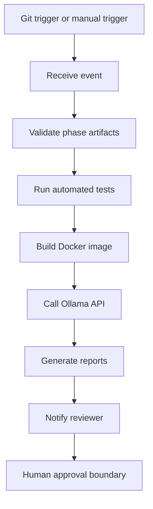

# n8n CI/CD Architecture

## n8n Role

n8n is the orchestration layer around the existing CI/CD components. It does
not replace GitHub Actions, pytest, Docker validation, or human review.

n8n coordinates:

- receiving a Git or manual phase event
- running phase validation
- running the automated test pipeline
- collecting Docker build evidence
- calling local Ollama for advisory review
- generating notification-ready summaries

## Workflow Design



## Trigger Strategy

Supported trigger modes:

- Git webhook for `push` or pull request activity.
- Manual trigger for phase review.
- Local dry-run trigger when `N8N_WEBHOOK_URL` is not configured.

Local dry-run mode is intentional. It proves the orchestration contract without
claiming that a real n8n server executed the workflow.

## Security Model

n8n must not store real secrets in Git.

Rules:

- Use environment variables for webhook URLs and tokens.
- Use placeholder values in documentation and sample workflow JSON.
- Do not deploy production automatically.
- Do not approve production automatically.
- Do not bypass failed tests.
- Keep production credentials outside the repository.

## Human Approval Boundary

n8n can recommend and notify. Humans decide.

Human approval is required for:

- merging protected branches
- staging promotion
- production deployment
- rollback execution

## Integration Points

Existing scripts:

```text
python scripts/phase_validator.py --phase 13.2
python scripts/phase13_2_test_pipeline.py
python scripts/phase13_1_docker_build.py
python scripts/n8n_ollama_review.py
```

Evidence outputs:

```text
docs/n8n/n8n_execution_report.json
docs/ai-devops/N8N_AI_REVIEW_REPORT.md
docs/reviews/PHASE_13.3_N8N_CICD_REPORT.md
```
