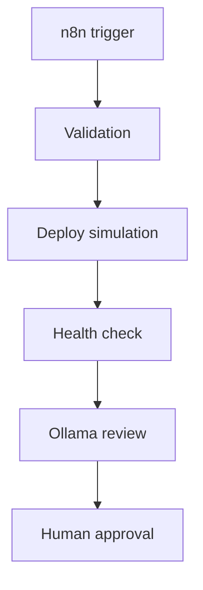

# n8n Deployment Workflow

## Purpose

n8n can orchestrate deployment simulation after tests and Docker build evidence
exist. It does not deploy production.

## Flow



## Commands

Validation:

```powershell
python scripts/phase_validator.py --phase 13.4
```

Deploy simulation:

```powershell
python scripts/phase13_4_deploy.py
```

Health check:

```powershell
python scripts/phase13_4_health_check.py
```

Rollback readiness:

```powershell
python scripts/phase13_4_rollback.py
```

## Human Approval Boundary

n8n can notify reviewers and collect evidence. It cannot approve staging,
production, or rollback.

## Production Boundary

Do not add production deployment nodes in Phase 13.4.
