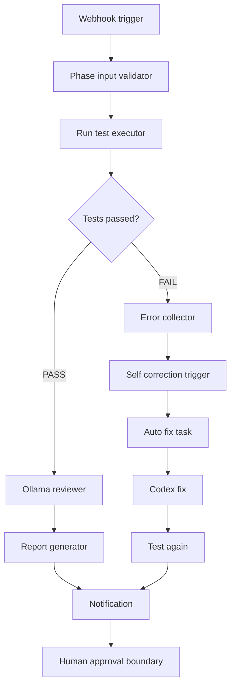

# n8n Real Automation Architecture

## n8n Role

n8n is the workflow orchestrator. It triggers existing automation components,
collects their outputs, and routes the result to the correct review path.

n8n does not replace tests, Codex, Ollama, or human approval.

## Workflow Design

## Trigger Methods

Supported triggers:

- n8n webhook event
- manual n8n execution
- local controller execution through `python scripts/n8n_phase_trigger.py`

If `N8N_WEBHOOK_URL` is not configured, the script runs local controller mode
and records evidence without claiming a real n8n server executed the workflow.

## Node Responsibilities

| Node | Responsibility |
| --- | --- |
| Webhook Trigger | Receives phase event. |
| Phase Input Validator | Confirms phase/action are allowed. |
| Run Test Executor | Calls existing AI review/test automation. |
| Decision Node | Routes PASS or FAIL. |
| Error Collector | Captures failed command output. |
| Self Correction Trigger | Calls retry controller and fix-task generator. |
| Ollama Reviewer | Calls local Ollama review. |
| Report Generator | Writes review evidence. |
| Notification | Tells humans what happened. |

## Security Boundary

n8n must not:

- auto deploy production
- auto merge code
- bypass human approval
- hide failed tests
- store real secrets

n8n can:

- trigger workflows
- execute approved local commands
- collect results
- notify status

Human approval remains required.
