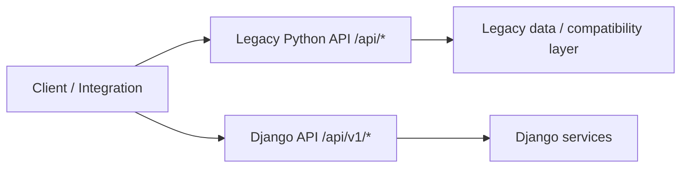
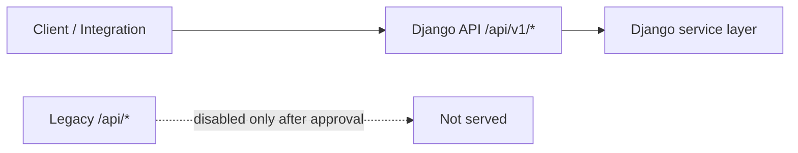
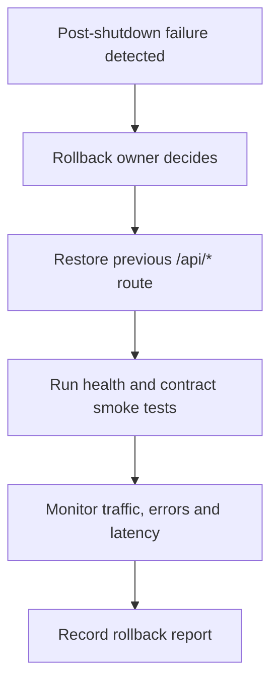

# Phase 11.1.6 Architecture Handover

## Before Migration Architecture

Before decommission readiness, clients may still call legacy `/api/*` routes
served by the legacy Python system. Django `/api/v1/*` exists as the replacement
API surface, but production traffic evidence must prove clients no longer need
legacy `/api/*`.

## After Migration Architecture

After a future approved shutdown, clients should use Django `/api/v1/*`.
Legacy `/api/*` is disabled at routing/proxy level only after real evidence and
real approvals pass.

## Legacy API Role

Legacy `/api/*` remains available until production evidence proves it has zero
traffic and all approval gates are complete. Legacy code is not deleted during
the rollback window.

## Django API Role

Django `/api/v1/*` is the replacement API. It must show real production traffic
before shutdown can be considered. The expected production success decision is
`READY_TO_EXECUTE_PRODUCTION`.

## Traffic Flow

| Flow | Current Status |
| --- | --- |
| Training simulation traffic | Accepted only for `READY_TO_EXECUTE_TRAINING` |
| Real production traffic | Required for `READY_TO_EXECUTE_PRODUCTION` |
| Simulation in production gate | `BLOCKED_SAFELY` |
| Unknown clients | Must be `0` |
| Legacy `/api/*` traffic | Must be `0` |

## Rollback Architecture

Rollback restores previous router/proxy behavior for `/api/*` while keeping
`/api/v1/*` online. Rollback does not require database schema changes.

## Architecture Boundary

Phase 11.1.6 provides readiness framework and documentation only. It does not
perform production route changes, IIS changes, proxy changes or database changes.
