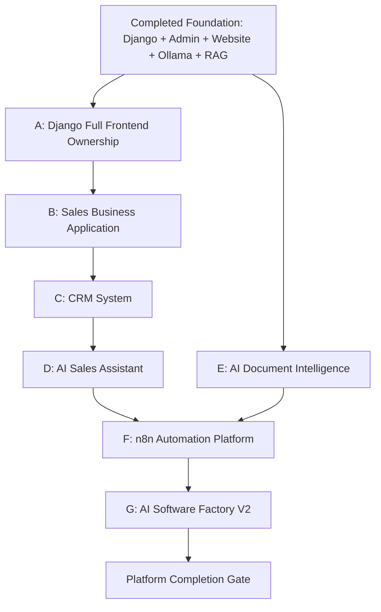

# Workstream Dependency Graph

## Dependency Notes

Workstream A depends on completed Django website and admin UI.

Workstream B depends on stable Django UI/API ownership.

Workstream C depends on customer, order, product, and sales integration points.

Workstream D depends on Sales, CRM, and Knowledge Assistant data.

Workstream E depends on the existing Knowledge Assistant and document model.

Workstream F depends on stable Django APIs and approved AI behaviors.

Workstream G depends on mature project workflows and review evidence.

