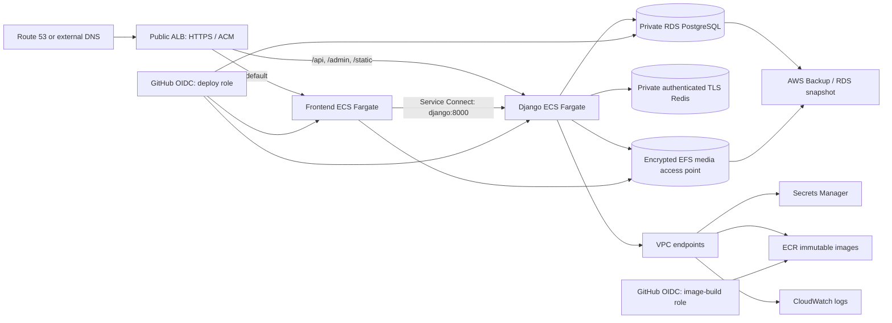

# AWS staging architecture

## Network boundary

- Two public subnets contain only the internet-facing ALB. They do not assign public IPs automatically.
- Two private application subnets contain backend/frontend Fargate tasks with `assign_public_ip = false`.
- Two private data subnets contain RDS, Redis and EFS mount targets.
- Application and data route tables have no internet route. ECR API/DKR, CloudWatch Logs and Secrets Manager use interface endpoints; ECR layer downloads use an S3 gateway endpoint.
- There is no NAT Gateway. This reduces fixed staging cost and prevents unrestricted task egress. Enabling an external AI/provider later requires a separately reviewed egress design.

## Traffic and security groups

The only public ingress is TCP 80/443 to the ALB. Port 80 redirects to HTTPS. ALB egress is limited to backend port 8000 and frontend port 8080. Backend ingress is limited to the ALB and the frontend compatibility proxy. PostgreSQL 5432, Redis 6379 and EFS 2049 accept only the appropriate application security groups.

ALB health uses Django liveness and the frontend root page. The public deployment smoke uses Django readiness and the read-only health endpoint.

## Data protection

- RDS is private, encrypted, uses an AWS-managed master password, and has a PostgreSQL 16 parameter group with `rds.force_ssl=1`.
- Redis is private, encrypted at rest and in transit, and uses an auth token read from the bootstrap-owned Secrets Manager secret. The token is present in bootstrap state, so state access is credential access.
- EFS is encrypted and mounted through one access point with TLS and IAM authorization. Django mounts it read/write at `MEDIA_ROOT`; Nginx mounts it read-only for `/media/`.
- Runtime Django/database/Redis/metrics values are empty Secrets Manager containers populated out-of-band; secret values are not stored in Git.

## Runtime and release safety

Backend tasks explicitly set `LINE_SEND_ENABLED=false`, disable both supported Ollama execution flags, disable Ollama capacity, and keep legacy DB access off. `PUBLIC_AI_ENABLED` and `PUBLIC_SYNTHETIC_RAG_DEMO_ENABLED` are application constants set to `False`; there are no corresponding environment variables to invent.

Web task startup remains Gunicorn only. Migration uses a distinct one-off task definition. The manual deployment workflow verifies exact Git SHA and ECR digests, creates and waits for an RDS snapshot, runs the migration task, checks exit code, then updates services and runs health checks. Any failed gate stops deployment.

Route 53 alias creation is optional. External DNS operators bind the documented ALB DNS name themselves. ACM certificate issuance and validation remain operator-owned; Terraform binds only an approved certificate ARN.

## Terraform ownership boundary

`infra/aws/bootstrap` owns the state bucket, optional account OIDC provider, image-build role, immutable ECR repositories, and Redis AUTH secret/version. `infra/aws/staging` consumes their non-secret identifiers and owns the network, ALB, ECS, RDS, Redis cluster, EFS, observability, backup, runtime secret containers, and distinct deployment role. The roots use different state keys and never share ownership of a physical resource.
