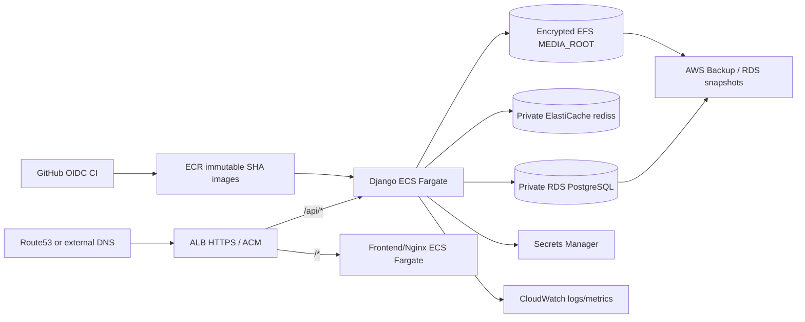

# AWS staging architecture

Public subnets contain ALB only; app/data services are private. Security groups allow ALB→ECS, ECS→RDS/Redis/EFS only. Same-origin HTTPS routes API and SPA. Detailed health/metrics are protected. Build exact SHA, scan, publish immutable digests, inject secrets, snapshot, run one migration task, update ECS and smoke. Rollback uses a prior digest only after schema review; otherwise forward fix/restore. EFS is used because current Django uses `FileSystemStorage`; S3 media is excluded pending a separate application feature.
